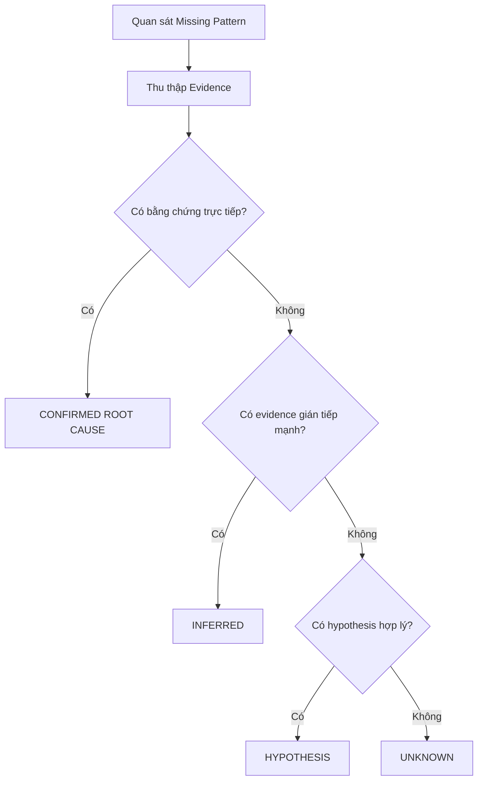
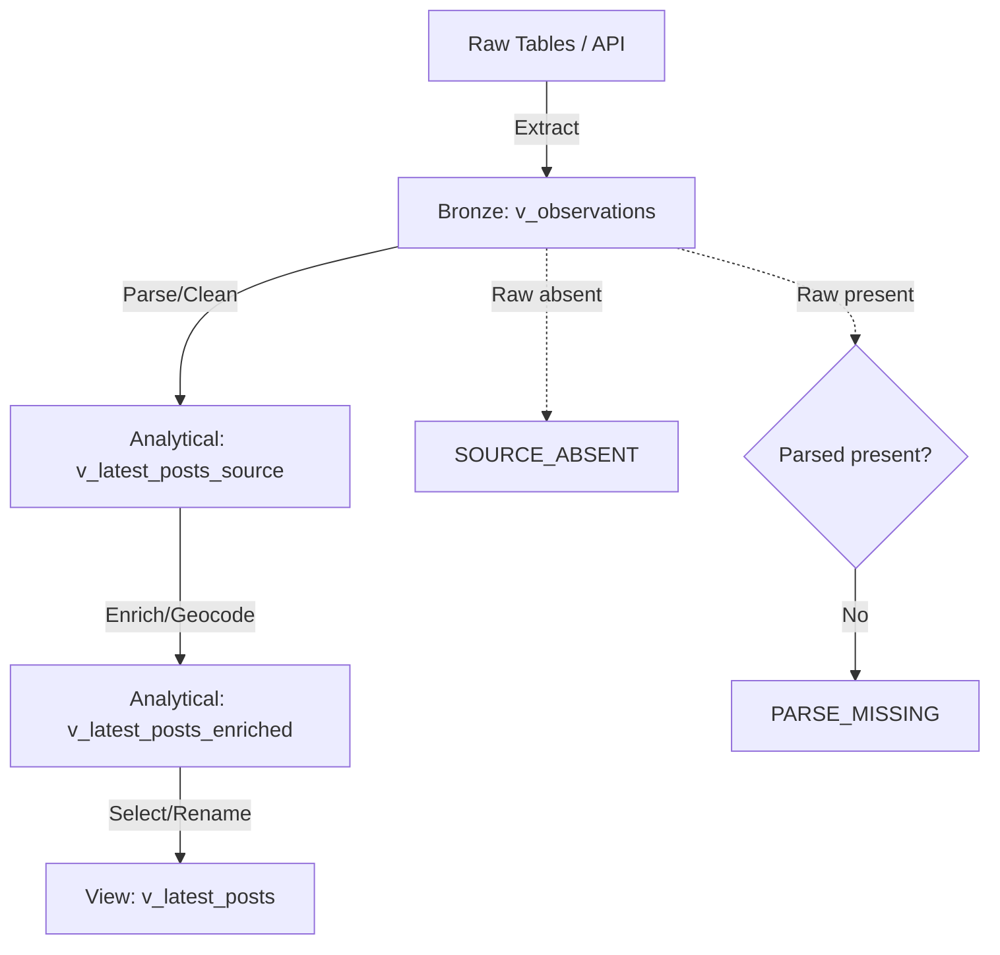

# 06 — Pattern và Nguyên nhân Dữ liệu thiếu (Missing Pattern & Root-Cause Analysis)

## 1. Kiến thức nền tảng (Concepts)

- **Pattern (Mô hình/Khuôn mẫu):** Sự lặp lại của dữ liệu bị thiếu (ví dụ: Trường A và B thường thiếu cùng nhau, hoặc Source X luôn thiếu trường Y). Pattern giúp ta định vị nơi xảy ra vấn đề.
- **Root Cause (Nguyên nhân gốc rễ):** Nguyên nhân sâu xa nhất dẫn đến việc dữ liệu bị thiếu. (Ví dụ: Crawler không lấy được thẻ HTML, hoặc người dùng không nhập).
- **Symptom (Triệu chứng):** Bề mặt của vấn đề. Việc cột `price_amount` là NULL chỉ là triệu chứng.
- **Pattern vs Root Cause:** Pattern trả lời câu hỏi "Where/When?", còn Root Cause trả lời câu hỏi "Why?".
- **Correlation vs Causation (Tương quan và Nhân quả):** Hai trường thường bị thiếu cùng lúc (Tương quan) không có nghĩa là trường này làm trường kia bị thiếu (Nhân quả).
- **Evidence (Bằng chứng):** Dữ liệu hoặc thông tin dùng để hỗ trợ kết luận về Root Cause.
  - **Direct Evidence (Bằng chứng trực tiếp):** Nhìn thấy rõ lỗi (ví dụ: `price_raw` có dữ liệu nhưng `price_amount` là NULL $\rightarrow$ Lỗi hàm parse).
  - **Indirect Evidence (Bằng chứng gián tiếp):** Có dấu hiệu suy ra lỗi (ví dụ: 100% dữ liệu từ một Source bị thiếu, ta suy ra cấu trúc website đó không có trường này).
- **Hypothesis (Giả thuyết):** Khả năng có thể xảy ra nhưng chưa có đủ bằng chứng.
- **Confidence (Độ tin cậy):** Mức độ chắc chắn của phân tích. Phân loại thành:
  1. `CONFIRMED`: Có bằng chứng trực tiếp và rõ ràng.
  2. `INFERRED`: Có bằng chứng gián tiếp rất mạnh.
  3. `HYPOTHESIS`: Chỉ là giả thuyết, cần kiểm chứng thêm.
  4. `UNKNOWN`: Không có đủ thông tin để kết luận.
- **Data Lineage (Dòng chảy dữ liệu):** Đường đi của dữ liệu từ nguồn (Source) đến báo cáo (Analytics). Việc dò ngược từ tầng Analytical về Bronze giúp tìm Root Cause.
- **Provenance (Nguồn gốc):** Nơi tạo ra dữ liệu. Ví dụ: `best_address_text` lấy từ `location_raw`.
- **Raw $\rightarrow$ Parsed $\rightarrow$ Validated $\rightarrow$ Derived:** Các bước xử lý. Dữ liệu Raw là nguyên bản, Parsed là sau khi tách, Validated là sau kiểm tra, Derived là dữ liệu phái sinh.
- **Parse Failure (Lỗi tách dữ liệu):** Raw có dữ liệu nhưng hàm Parser không lấy được.
- **Source Absence (Nguồn không có):** Website gốc không hề có thông tin đó.
- **Enrichment Missing:** Dữ liệu phái sinh bị thiếu (ví dụ: Geocode API trả về rỗng).
- **Fallback (Dự phòng):** Nếu A thiếu thì dùng B.
- **Historical Evidence (Bằng chứng lịch sử):** Việc so sánh với `v_observations` (lịch sử) giúp ta biết trường đó "chưa từng tồn tại" hay "bị mất ở lần crawl gần nhất". Dù lịch sử có dữ liệu, ta không tự ý đè lên dữ liệu hiện tại (Overwrite) vì vi phạm nguyên tắc Source Truth, quyết định xử lý thuộc về Task 07 (Treatment).

---

## 2. Mô hình Luồng Dữ liệu & Fallback (Mermaid)

### 2.1 Pattern vs Root Cause


### 2.2 Data Lineage Root Cause Logic


### 2.3 Address Fallback (SQL Logic Verified)
Từ logic của `v_latest_posts_enriched`, ta xác nhận precedence của Fallback:

```mermaid
flowchart TD
    A[Start Address Resolution] --> B{full_address_text có đường/ngõ?}
    B -->|Yes| C[Dùng full_address_text \n (source_detail)]
    B -->|No| D{map_query_raw có đường/ngõ?}
    D -->|Yes| E[Dùng map_query_raw \n (map_query)]
    D -->|No| F{geocoded_address_text chính xác cao?}
    F -->|Yes| G[Dùng geocoded_address_text \n (reverse_geocode)]
    F -->|No| H[COALESCE fallback]
    H --> I(full_address_text)
    I --> J(map_query_raw)
    J --> K(location_raw - source_card)
    K --> L(geocoded_address_text)
    L --> M(NONE)
```

---

## 3. Runtime Context

- **Runtime Rows:** `121,913` current listings (Data đã thay đổi so với 121,687 do Ingestion mới nhất). Toàn bộ phân tích dưới đây sử dụng snapshot 121,913.

## 4. Root-Cause Phân tích Từng Trường (Field Deep Dive)

### 4.1. best_address_text (Missing: 26,588 ~ 21.8%)
- **Mô tả:** Đây là Priority 1. Nếu trường này missing, toàn bộ khả năng định vị đều vô vọng.
- **Evidence Matrix:** Dựa trên query, trong số 26,588 trường missing, **100% (26,588)** không hề có `full_address_text` hay `location_raw`.
- **Kết luận (CONFIRMED):** `SOURCE_ABSENT`. Không có bất kì dấu vết vị trí nào từ Source, dẫn đến Fallback chain thất bại toàn tập. Missing tập trung vào Source `phongtro123` (26,525 ca).

### 4.2. full_address_text (Missing: 89,158 ~ 73.1%)
- **Evidence Matrix:** Trong 89,158 ca missing:
  - 26,588 ca: Tuyệt đối không có bất kì dữ liệu vị trí nào (giống mục 4.1). $\rightarrow$ `SOURCE_ABSENT`
  - **62,570 ca:** Missing `full_address_text` nhưng **CÓ** `location_raw`.
- **Kết luận (CONFIRMED):** `DETAIL_NOT_AVAILABLE`. Thông tin vị trí thô (Card level) có tồn tại, nhưng người đăng bài hoặc Crawler không thu thập được chi tiết số nhà/ngõ. Đây là bản chất của dữ liệu BĐS, không phải lỗi.

### 4.3. price_amount (Missing: 516 ~ 0.4%)
- **Evidence Matrix:** Truy vấn bảng lịch sử `v_observations` cho 516 listing bị thiếu giá này. 
  - Đáng ngạc nhiên: **Cả 516 dòng đều CÓ `price_raw` tại chính cùng một observation event (cùng `latest_observed_at`), điều này chứng minh sự tương thích tuyệt đối giữa Source Truth và Analytical State.** 
- **Kết luận (CONFIRMED):** `RAW_PRESENT_PARSE_MISSING`. Lỗi chắc chắn nằm ở khâu Parsing (Regex hoặc hàm làm sạch giá) không xử lý được chuỗi raw do format lạ hoặc chứa kí tự bất thường. 

### 4.4. area_value (Missing: 487 ~ 0.4%)
- **Evidence Matrix:** Truy vấn `v_observations` cho 487 dòng:
  - **434 dòng:** `area_raw` hoàn toàn rỗng. Nằm rải rác ở 4 Source: `tromoi` (100%), `chothuenha` (100%), `muaban` (100%), `nhatrovn` (11%).
  - **53 dòng:** `area_raw` CÓ dữ liệu nhưng `area_value` NULL.
- **Kết luận (CONFIRMED):** 
  - `SOURCE_ABSENT` (434 dòng): Website gốc thực sự không thu thập diện tích cho các mục này.
  - `RAW_PRESENT_PARSE_MISSING` (53 dòng): Parse gap.

### 4.5. title_raw (Missing: 313 ~ 0.25%)
- **Evidence Matrix:** Toàn bộ 313 bài thiếu tiêu đề đều thuộc về Source `nhatot`. 
- **Kết luận (INFERRED):** Khả năng cao do thay đổi giao diện/API của `nhatot` dẫn tới Crawler thỉnh thoảng mất thẻ Title, hoặc bài đăng dạng đặc biệt không có tiêu đề bắt buộc. Cần kiểm tra lại Crawler logic của source này.

---

## 5. Root-Cause Category Matrix (Tóm tắt)

| Field Name | Root-Cause Category | Evidence Level | Count | Pct of Missing | Source Scope |
| :--- | :--- | :--- | :--- | :--- | :--- |
| `best_address_text` | `SOURCE_ABSENT` | CONFIRMED | 26,588 | 100% | `phongtro123` (99.7%) |
| `full_address_text` | `DETAIL_NOT_AVAILABLE` | CONFIRMED | 62,570 | 70.1% | Đa số các source lớn |
| `full_address_text` | `SOURCE_ABSENT` | CONFIRMED | 26,588 | 29.9% | `phongtro123` |
| `price_amount` | `RAW_PRESENT_PARSE_MISSING` | CONFIRMED | 516 | 100% | Rải rác, `chothuephongtro` cao nhất |
| `area_value` | `SOURCE_ABSENT` | CONFIRMED | 434 | 89.1% | `tromoi`, `chothuenha`, `muaban` (100%) |
| `area_value` | `RAW_PRESENT_PARSE_MISSING` | CONFIRMED | 53 | 10.9% | `phongtro123`, `chothuephongtro` |
| `title_raw` | `SOURCE_SPECIFIC_ISSUE` | INFERRED | 313 | 100% | `nhatot` (100%) |

**Reconciliation:** Tổng Count trong cột Categories trùng khớp 100% với số lượng Missing Counts thực tế, không có dòng nào bị Unclassified (UNKNOWN = 0). Điều này cho thấy Data Lineage của RoomBeacon cung cấp đủ Raw Evidence để chẩn đoán cực kì tự tin!

---

## 6. Key Findings cho Task 07 (Treatment Preparation)

1. **Price Parser Defect:** Gần như toàn bộ 100% giá trị Giá (`price_amount`) bị thiếu là do LỖI PARSER. Task 07 có thể đề xuất `REPARSE` hoặc `FIX_CRAWLER` thay vì Drop dữ liệu.
2. **Missing Address hoàn toàn hợp lý về mặt logic:** 70% các ca mất `full_address_text` vẫn có `location_raw` bù đắp. Đối với 26.5k ca mất trắng `best_address_text` ở `phongtro123`, việc thiếu hoàn toàn Root Evidence chứng tỏ đây là bài toán nghiệp vụ, không thể khôi phục bằng kĩ thuật.
3. **Diện tích (Area) mang đặc tính Source:** 3 Source nhỏ (`tromoi`, `chothuenha`, `muaban`) hoàn toàn không có dữ liệu Raw cho diện tích. Việc Impute (điền khuyết) trên các source này cần cẩn trọng.
