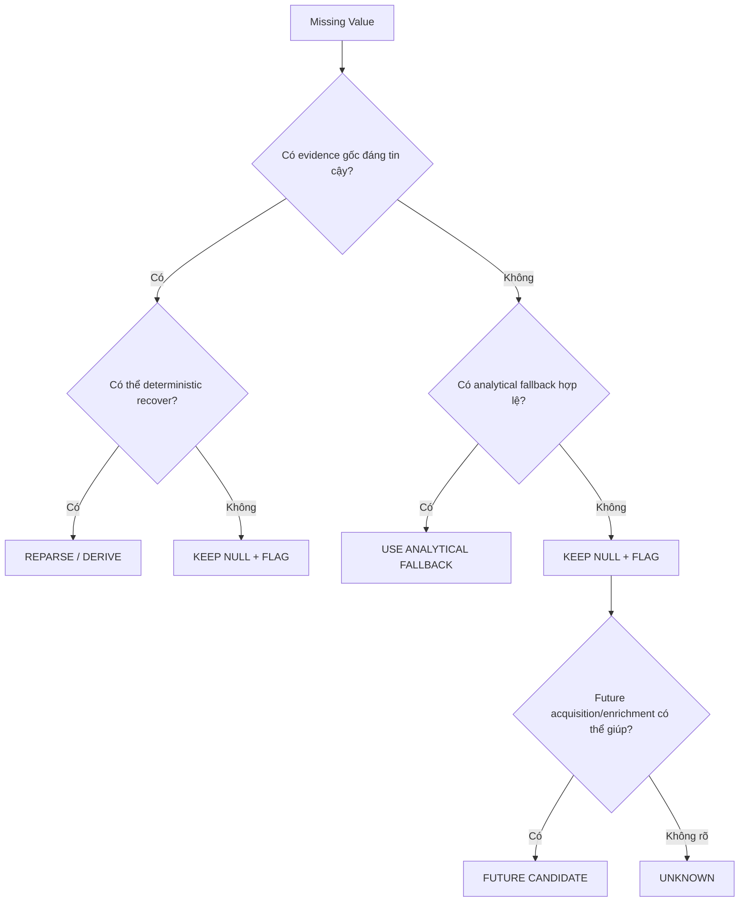
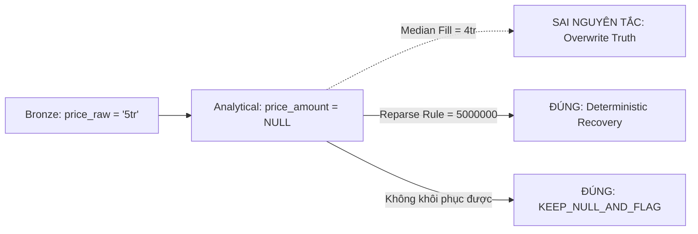
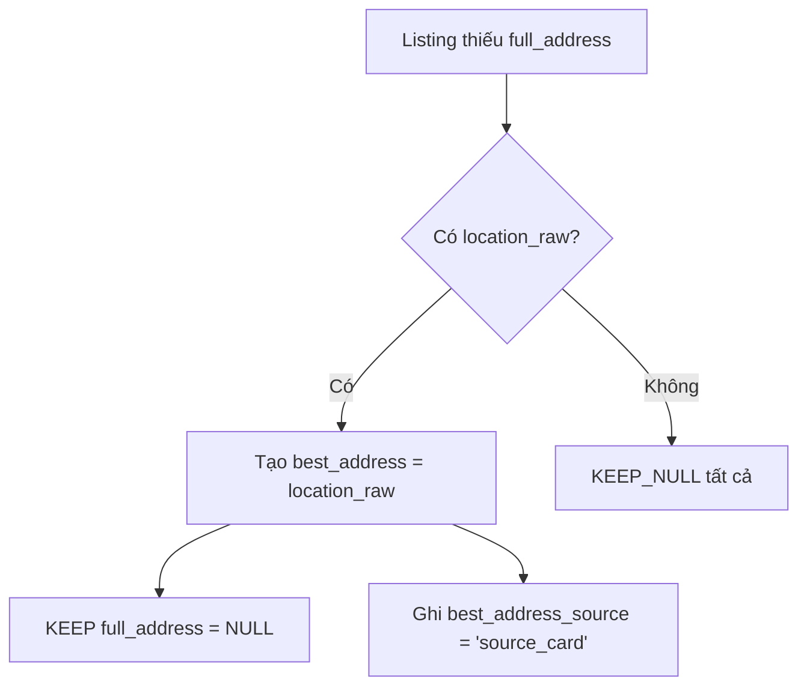
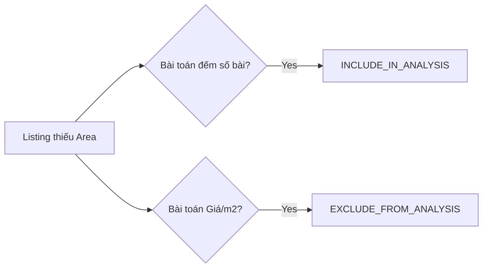

# 07 — Chiến lược Xử lý Dữ liệu thiếu (Missing Data Treatment Strategy)

## 1. Mục tiêu và Nguyên tắc Cốt lõi

- **Missing Data Treatment** là quá trình quyết định cách xử lý các giá trị rỗng (NULL/Missing) dựa trên nguyên nhân gốc rễ (Root Cause) đã xác định.
- **Nguyên tắc "Source Truth" (Sự thật gốc):** Tuyệt đối không thay đổi, ghi đè (overwrite) hoặc giả mạo dữ liệu được thu thập từ nguồn (Bronze Layer). Analytical Assumption không được biến thành Source Fact.
- **Data Cleaning $\neq$ Data Deletion:** Không dùng chiến lược mặc định là drop (xóa) toàn bộ record chỉ vì thiếu một trường dữ liệu. Một bài đăng thiếu diện tích vẫn rất có giá trị cho việc đếm tổng số bài đăng hoặc phân tích phân bố địa lý.
- **Không Statistical Imputation mặc định:** Việc điền khuyết bằng Trung bình (Mean), Trung vị (Median), Yếu vị (Mode), hoặc Forward/Backward Fill bị cấm áp dụng trực tiếp lên dữ liệu phân tích chuẩn của RoomBeacon. Việc này có thể làm sai lệch Source Truth, gây nhiễu (noise) cho Machine Learning model và phá vỡ Data Lineage.
- **Complete Case Analysis:** Phân tích chỉ trên các bản ghi có đủ 100% dữ liệu. Cách này dễ làm mất mát thông tin (Information Loss) và gây ra Selection Bias (Thiên lệch chọn mẫu - ví dụ: loại bỏ toàn bộ bài từ các nguồn không có trường Diện tích). Chúng ta ưu tiên Pairwise/Analysis-specific usage.
- **Analysis-specific Usability:** Khả năng sử dụng dữ liệu phụ thuộc vào từng bài toán phân tích cụ thể (Ví dụ: Thiếu diện tích thì không tính `price_per_m2`, nhưng vẫn dùng để phân tích số lượng bài đăng).
- **Data Recovery:** Khôi phục giá trị thiếu từ các bằng chứng (evidence) thô đã tồn tại thông qua Deterministic Recovery (ví dụ chạy lại hàm regex parser) mà không suy đoán.
- **Analytical Fallback:** Cho phép sử dụng một trường phái sinh (ví dụ `best_address_text` lấy từ `location_raw`) làm giải pháp thay thế khi phân tích không đòi hỏi mức độ chi tiết cao, đồng thời vẫn bảo toàn Provenance (nguồn gốc của fallback).

## 2. Taxonomy Các Hành động Xử lý (Treatment Actions)

1. `KEEP_NULL`: Giữ nguyên NULL vì không có bằng chứng đáng tin cậy.
2. `REPARSE_FROM_RAW`: Khôi phục lại từ dữ liệu Raw đã tồn tại (Deterministic Recovery).
3. `DERIVE_FROM_EXISTING_EVIDENCE`: Tạo trường phái sinh mới từ logic tổng hợp.
4. `USE_ANALYTICAL_FALLBACK`: Sử dụng trường Fallback cho các phân tích phù hợp.
5. `KEEP_NULL_AND_FLAG`: Giữ NULL và gắn Data Quality Flag để cảnh báo downstream.
6. `EXCLUDE_FROM_SPECIFIC_ANALYSIS`: Vẫn giữ Record, chỉ loại trừ khỏi một số phép tính phân tích nhất định.
7. `RETRY_OR_RECRAWL_CANDIDATE`: Đánh dấu cần thu thập lại từ Source.
8. `ENRICHMENT_CANDIDATE`: Đánh dấu cần làm giàu dữ liệu từ API bên ngoài.

---

## 3. Lược đồ Ra Quyết Định & Xử lý (Mermaid)

### 3.1 Treatment Decision Tree

### 3.2 Source Truth vs Analytical Layer

### 3.3 Address Treatment Semantic

### 3.4 Analysis-Specific Usability (Sự khả dụng theo phân tích)

---

## 4. Treatment Matrix (Áp dụng trên 121,929 listings hiện tại)

| Field Name | Current Missing | Root Cause Category | Treatment Action | Target Layer | Source Truth Modified | Notes |
| :--- | :--- | :--- | :--- | :--- | :--- | :--- |
| `price_amount` | 516 | `PARSE_GAP_CANDIDATE` | **REPARSE_FROM_RAW** | Analytical | Không | Cần viết lại Regex để bắt các format thô hiện có. |
| `area_value` | 53 | `PARSE_GAP_CANDIDATE` | **REPARSE_FROM_RAW** | Analytical | Không | Khôi phục bằng Regex mới. |
| `area_value` | 434 | `NO_RAW_EVIDENCE` | **KEEP_NULL_AND_FLAG** | Analytical | Không | Không dùng mean imputation. Đánh dấu `area_raw_not_observed`. |
| `title_raw` | 330 | `SOURCE_SPECIFIC_ISSUE` | **KEEP_NULL_AND_FLAG** | Analytical | Không | Đánh dấu lỗi Crawler ở `nhatot`. |
| `full_address_text` | 89,174 | `NOT_VERIFIED` | **KEEP_NULL** | Analytical | Không | Tuyệt đối **không copy** từ `best_address` sang. Không dùng cho Exact Matching. |
| `location_raw` | 26,753 | `SOURCE_ABSENT` | **KEEP_NULL_AND_FLAG** | Analytical | Không | Cảnh báo thiếu thông tin phường/xã. |
| `best_address_text` | 26,591 | `NO_USABLE_EVIDENCE` | **KEEP_NULL_AND_FLAG** | Analytical | Không | Gắn nhãn **ENRICHMENT_CANDIDATE** để API tương lai lấp đầy. |

### 4.1 Chi tiết Treatment các trường cốt lõi
- **Price Treatment:** Dữ liệu hoàn toàn có thể khôi phục từ `price_raw` (P1 Priority - Recoverable from current evidence). 
- **Area Treatment:** Những dữ liệu bị parse hỏng sẽ được khôi phục. Các source không có Area sẽ được giữ nguyên rỗng, và đánh dấu không dùng cho phép tính `price_per_m2`.
- **Address Treatment:** Trường `full_address_text` phải rỗng (NULL) nếu source không cấp, chỉ cho phép dùng `best_address_text` như một Analytical Fallback để làm phân tích địa lý chung. Giá trị `best_address_source = 'none'` (không phải missing metadata) mang ý nghĩa "Không có bất kì nguồn dữ liệu địa chỉ nào từ Crawler".
- **Temporal Treatment:** Các trường thời gian (`first_observed_at`, `latest_observed_at`) nếu bị lỗi logic (ví dụ `first > last`) sẽ KHÔNG bị ghi đè hay đảo ngược. Thay vào đó, tạo cờ `temporal_inconsistent` để lọc bỏ trong các bước Time-series Analysis.

## 5. Analysis Usability Matrix

Bảng dưới đây minh họa việc sử dụng dữ liệu thiếu (KEEP_NULL) trong các Use-case khác nhau (Thay vì xóa Row):

| Phân tích (Analysis Type) | Nếu thiếu `price_amount` | Nếu thiếu `area_value` | Nếu thiếu `full_address_text` | Nếu thiếu `best_address_text` |
| :--- | :--- | :--- | :--- | :--- |
| **Listing Count (Đếm số lượng)** | Vẫn dùng (Usable) | Vẫn dùng (Usable) | Vẫn dùng (Usable) | Vẫn dùng (Usable) |
| **Price Distribution (Phân bổ giá)** | Exclude (Loại trừ) | Vẫn dùng (Usable) | Vẫn dùng (Usable) | Vẫn dùng (Usable) |
| **Price-per-m2 (Giá/m2)** | Exclude | Exclude | Vẫn dùng (Usable) | Vẫn dùng (Usable) |
| **Geographic Analysis (Vùng/Quận)** | Vẫn dùng (Usable) | Vẫn dùng (Usable) | **Fallback to best_address** | Exclude |
| **Street-level Geocoding** | Vẫn dùng (Usable) | Vẫn dùng (Usable) | **Exclude** | Exclude |

## 6. Đề xuất Data Quality Flags cho PART 02

Để chuẩn bị cho quy trình Cleaning, các cờ (Flag) sau được thiết kế:
- `flag_price_parse_gap`: Giá bị NULL nhưng raw có dữ liệu.
- `flag_area_parse_gap`: Diện tích bị NULL nhưng raw có dữ liệu.
- `flag_area_not_observed`: Nguồn không thu thập diện tích.
- `flag_no_address_evidence`: Thiếu hoàn toàn fallback (`best_address_text` IS NULL).
- `flag_temporal_inconsistent`: Lỗi logic mốc thời gian crawl.

## 7. Readiness Decision

- **Quyết định:** `PART_01_READY_FOR_PART_02`
- **Lý do:** Chúng ta đã Inventory đầy đủ cấu trúc, định nghĩa ngữ nghĩa rõ ràng, profile và trực quan hóa chi tiết các pattern missing, chẩn đoán Root Cause từ Data Lineage và đưa ra Treatment Policy không phá vỡ Source Truth. Dữ liệu đã sẵn sàng để chuyển sang PART 02 nhằm tạo ra Validation Flags và Derived Fields.
