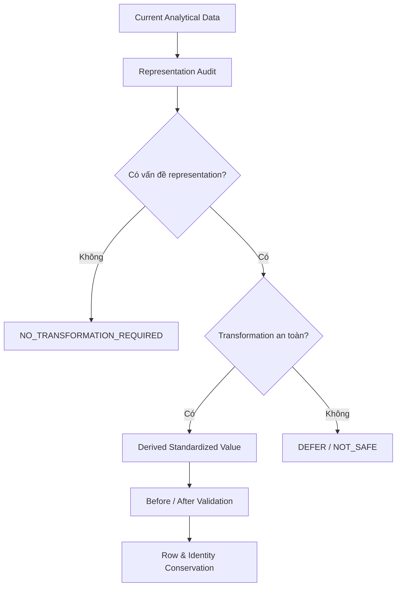
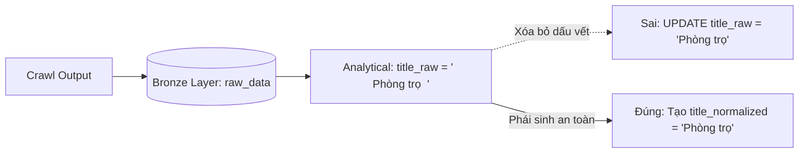
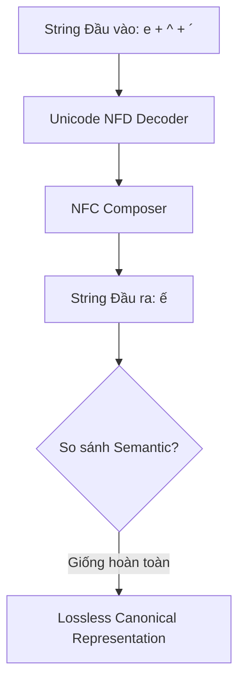
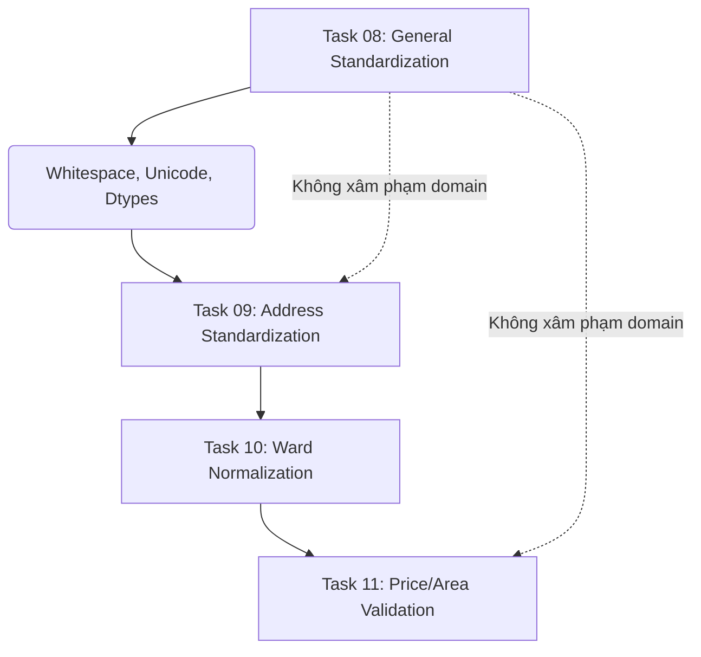

# 08 — Chuẩn hóa Dữ liệu Tổng quát (General Data Standardization)

## 1. Kiến thức cốt lõi về Chuẩn hóa Dữ liệu

### 1.1 Data Standardization là gì?
- **Data Standardization (Chuẩn hóa dữ liệu cấu trúc/representation):** Là quá trình đưa dữ liệu về một định dạng tiêu chuẩn (Canonical Representation) thống nhất, dễ đoán và so sánh. Quá trình này **không** thay đổi ngữ nghĩa (Semantic) của dữ liệu.
- Phân biệt với **Statistical Standardization (Chuẩn hóa thống kê - z-score):** Việc chuyển biến về trung bình 0 và độ lệch chuẩn 1 (Z-score) dùng trong Machine Learning là chuẩn hóa phân phối, khác hoàn toàn với chuẩn hóa Representation trong Data Engineering.

### 1.2 Data Cleaning khác Data Standardization như thế nào?
- **Standardization:** Chỉnh sửa cách biểu diễn (ví dụ: cắt khoảng trắng dư, đưa Unicode về chuẩn NFC, thống nhất chữ hoa/thường cho category).
- **Cleaning:** Loại bỏ hoặc sửa đổi các dữ liệu bị sai lệch logic (ví dụ: giá phòng 1 tỷ USD -> lọc bỏ Outlier, hoặc map ward_name sai chính tả về đúng danh mục chuẩn).
- Standardization tạo tiền đề cho Cleaning dễ dàng hơn (Ví dụ: So sánh chuỗi sẽ không bị sai lệch do khoảng trắng hay Unicode ẩn).

### 1.3 Unicode Normalization (NFC, NFD)
- Văn bản tiếng Việt có thể biểu diễn dấu bằng nhiều cách:
  - **NFC (Normalization Form Canonical Composition):** Kết hợp các ký tự gốc và dấu thành một ký tự duy nhất (Ví dụ: `e` + `^` + `´` = `ế` - 1 ký tự).
  - **NFD (Normalization Form Canonical Decomposition):** Tách riêng chữ cái và các dấu (Ví dụ: `ế` = `e` + `^` + `´` - 3 ký tự).
- Hai chuỗi hiển thị giống hệt nhau trên màn hình nhưng nếu khác dạng (NFC vs NFD) thì máy tính sẽ đánh giá là khác nhau (`"ế" == "ế"` sẽ trả về `False`). Do đó, chuẩn hóa text tiếng Việt **bắt buộc** phải sử dụng `NFC` làm Canonical Representation.
- **NFKC/NFKD:** Các chuẩn có tính tương thích (Compatibility), có thể làm biến đổi các ký tự (Ví dụ: `1/2` thành ký tự `½`). Không nên dùng mặc định để tránh Lossy Transformation.

### 1.4 Lossless, Lossy và SOURCE-PRESERVING SEMANTICALLY LOSSLESS CANONICALIZATION
- **Lossless (Bảo toàn):** Không làm mất mát thông tin ngữ nghĩa (ví dụ Unicode NFC).
- **Lossy (Mất mát):** Thay đổi hẳn thông tin gốc (ví dụ: chuyển chuỗi thành lowercase, xóa dấu tiếng Việt). 
- **Reversible (Có thể đảo ngược):** Từ chuỗi kết quả có thể khôi phục 100% chuỗi ban đầu.
- **Idempotency (Tính lũy đẳng):** $f(f(x)) = f(x)$. Chạy hàm chuẩn hóa 2 lần không làm thay đổi giá trị so với chạy 1 lần.

### 1.5 Decimal vs Float
- Dữ liệu tài chính (`price_amount`) cần tính toán chính xác số học hệ cơ số 10.
- Nếu lưu bằng `FLOAT`, hệ nhị phân có thể sinh ra sai số (ví dụ: `0.1 + 0.2 = 0.30000000000000004`).
- `DECIMAL(15,2)` bảo toàn chính xác độ lớn tài chính. Không được tự ý ép kiểu (cast) về FLOAT.

### 1.6 Cấm Overwrite Raw Fields (Bảo toàn Source Truth)
- Tuyệt đối không lưu đè giá trị đã qua chuẩn hóa lên các cột raw (`title_raw`, `location_raw`). 
- Chúng ta sử dụng chiến lược sinh ra cột phái sinh (Derived Representation) như `title_normalized`.

---

## 2. Các Sơ đồ Kiến trúc (Mermaid)

### 2.1 Standardization Flow

### 2.2 Source Truth Concept

### 2.3 Unicode NFC Transformation

### 2.4 Task Boundary (Ranh giới các Task)

---

## 3. Runtime Audit & Phát hiện (Findings)

Thực hiện Audit trên Runtime `121,929` listings:

### 3.1 Text Representation Audit
- `title_raw`: 629 trường hợp representation chưa ở canonical NFC target của RoomBeacon, 1 trường hợp lỗi khoảng trắng dư thừa.
- `full_address_text`: 563 trường hợp representation chưa ở canonical NFC target của RoomBeacon, 47 trường hợp lỗi khoảng trắng.
- `location_raw`: 569 trường hợp representation chưa ở canonical NFC target của RoomBeacon.
- `best_address_text`: 566 trường hợp representation chưa ở canonical NFC target của RoomBeacon, 47 trường hợp lỗi khoảng trắng.
- **Empty String:** Không phát hiện chuỗi rỗng `""` hoặc chuỗi chứa toàn khoảng trắng `"  "`. Toàn bộ missing data đều đã là physical NULL.

### 3.2 Categorical Audit
- `source_code` (9 distinct values) và `best_address_source` (3 distinct values) đều là lowercase chuẩn mực, không chứa khoảng trắng ẩn, không có issue về Unicode. 
- $\rightarrow$ **NO_TRANSFORMATION_REQUIRED**.

### 3.3 Numeric & Temporal Representation Audit
- `price_amount`: Định dạng `DECIMAL(15,2)`. Chuẩn xác, tránh lỗi floating-point.
- `area_value`: Định dạng `DECIMAL(10,2)`. Chuẩn xác.
- `active_days`: Định dạng `BIGINT`.
- Các trường `TIMESTAMP`: Đều đạt độ phân giải Microsecond. Database không encode timezone cụ thể (timezone unknown/local).
- $\rightarrow$ **NO_TRANSFORMATION_REQUIRED** cho toàn bộ Numeric & Temporal (Không có lý do để đổi dtype hay round).

---

## 4. Standardization Contract & Hướng giải quyết

Vì Text Fields bộc lộ Issue về Unicode và Khoảng trắng, ta thiết lập Contract sau:

| Field Gốc | Issue Phát hiện | Standardization Rule | Output Derived Field | Loss Risk | Decision |
| :--- | :--- | :--- | :--- | :--- | :--- |
| `title_raw` | Unicode NFD, Extra Whitespace | NFC + Trim + Collapse Spaces | `title_normalized` | Lossless | **APPLIED** |
| `full_address_text` | Unicode NFD, Extra Whitespace | NFC + Trim + Collapse Spaces | `full_address_normalized` | Lossless | **APPLIED** |
| `location_raw` | Unicode NFD | NFC + Trim + Collapse Spaces | `location_normalized` | Lossless | **APPLIED** |
| `best_address_text` | Unicode NFD, Extra Whitespace | NFC + Trim + Collapse Spaces | `best_address_normalized` | Lossless | **APPLIED** |
| `source_code` | None | None | N/A | N/A | NO_TRANSFORMATION |
| `price_amount` | None | None | N/A | N/A | NO_TRANSFORMATION |

### Chú ý về DEFERRED_TRANSFORMATIONS
- **Address Semantic Parsing:** Tách đường, phường, quận sẽ bị dời (DEFER) sang **Task 09**.
- **Map danh mục Phường/Xã (Ward Mapping):** Dời sang **Task 10**.
- **Price/Area Validation (Outlier, sửa Parse Gap):** Dời sang **Task 11**.

---

## 5. Kết luận Bảo toàn Dữ liệu (Conservation Result)

- **Row Conservation:** PASS. Quá trình sinh ra cột Derived không làm thay đổi tổng số dòng của dataset (`121,929` rows before = `121,929` rows after). Không có thao tác Drop Row.
- **Identity Conservation:** PASS. Tổ hợp khóa định danh (`source_code`, `source_listing_id`) không bị biến đổi. Khóa sinh `rental_post_id` nguyên vẹn.
- **Idempotency:** PASS. Hàm `normalize_whitespace` và `normalize_unicode` (vừa được đóng gói trong `notebooks/utils/text_standardization.py`) có tính chất Idempotent. Chạy nhiều lần không làm text biến đổi thêm.
