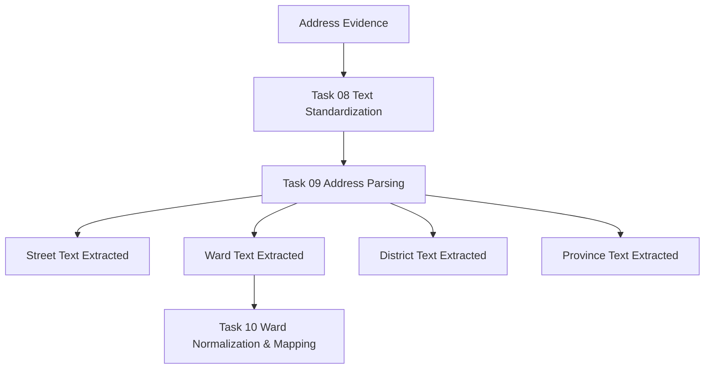
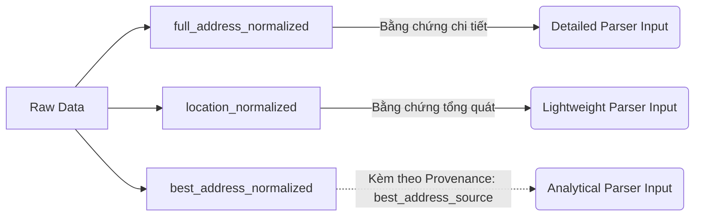
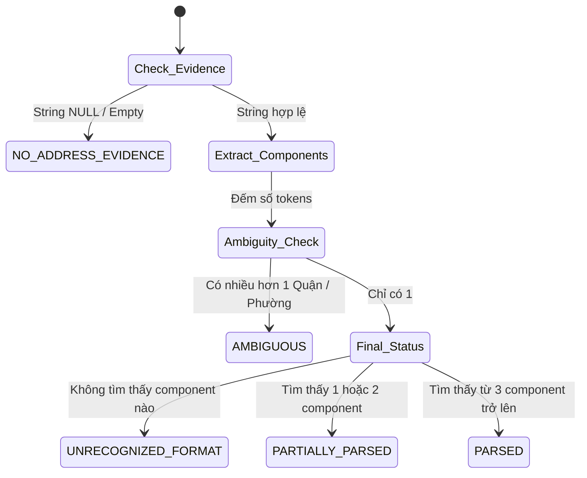
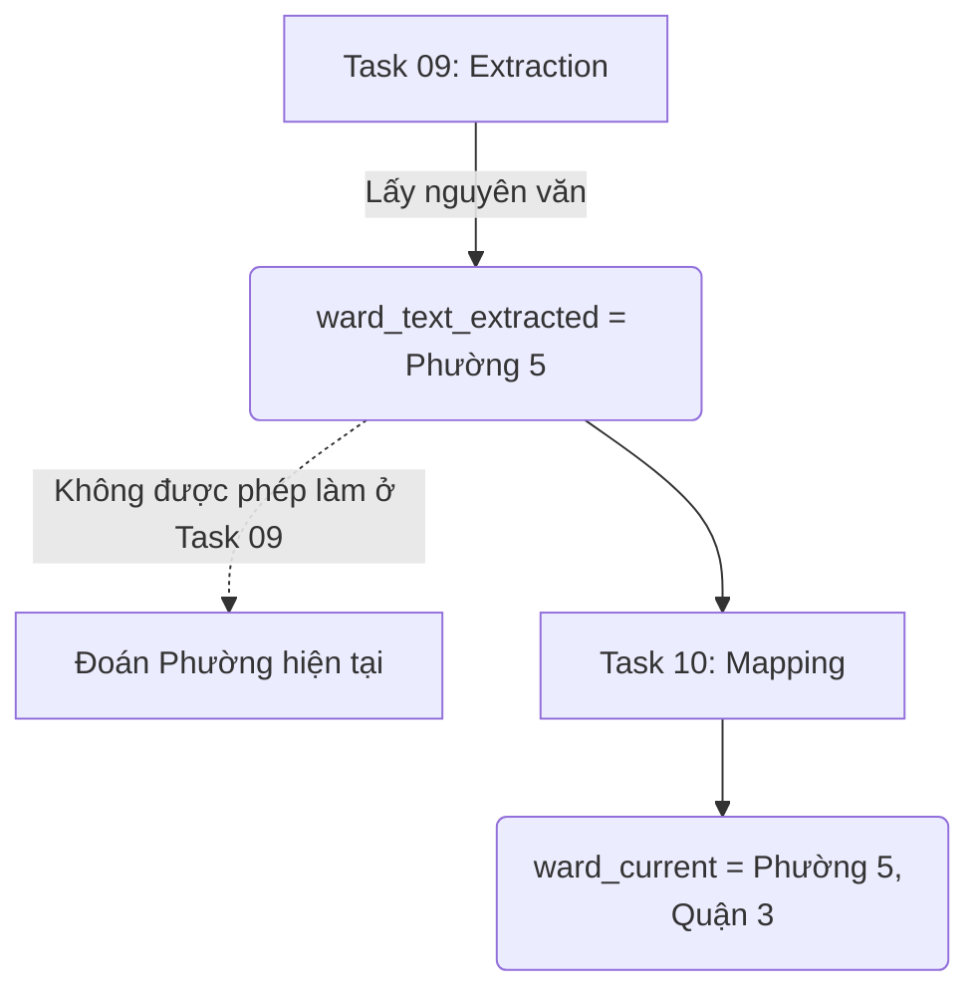

# 09 — Chuẩn hóa và phân tích cấu trúc địa chỉ (Address Standardization & Structural Parsing)

## 1. Kiến thức cốt lõi về Address Parsing

### 1.1 Address Standardization vs Address Parsing
- **Address Standardization (Chuẩn hóa địa chỉ):** Là quá trình làm sạch representation của chuỗi văn bản (ví dụ: chuyển từ Unicode NFD về NFC, cắt khoảng trắng dư). Việc này không thay đổi ngữ nghĩa.
- **Address Parsing (Phân tách cấu trúc):** Là quá trình nhận diện các phần tử (component) có ý nghĩa bên trong chuỗi văn bản (như Phường, Quận, Đường) và gán chúng vào các field riêng biệt.

### 1.2 Parsing khác Enrichment thế nào?
- **Parsing (Bóc tách/Extraction):** Chỉ lấy những gì đã có sẵn trong văn bản. Nếu chuỗi là "Quận 1, TPHCM", parser chỉ extract ra "Quận 1" và "TPHCM", phường sẽ để NULL.
- **Enrichment (Làm giàu/Inference):** Dùng dữ liệu bên ngoài hoặc logic để suy đoán. Ví dụ: từ tọa độ suy ra phường, hoặc dùng OpenStreetMap API. **Task 09 tuyệt đối không làm Enrichment/Inference.**

### 1.3 Cấu trúc dữ liệu & Thuật ngữ
- **Unstructured Text:** Một chuỗi văn bản tự do, ví dụ: "Nhà đẹp hẻm 3/2 P14 Q10".
- **Structured Data:** Dữ liệu đã được chia thành các trường (fields) rõ ràng (`ward_text_extracted` = "Phường 14").
- **Token:** Một từ hoặc cụm từ có ý nghĩa (ví dụ: "Phường", "Quận").
- **Delimiter (Dấu phân cách):** Ký tự ngắt các thành phần, thường là dấu phẩy `,`, dấu gạch ngang `-`, hoặc khoảng trắng.
- **Rule-based Parser vs Giant Regex:** Thay vì dùng một biểu thức chính quy (Regex) khổng lồ rất dễ gãy (brittle) khi cấu trúc thay đổi nhẹ, ta dùng **Deterministic Parsing** với các Regex nhỏ gọn (vd: tìm chính xác pattern của Quận riêng, Phường riêng).
- **Partial Parsing:** Trạng thái khi bóc tách được một số thành phần nhưng không đầy đủ (vd: có Quận nhưng không có Đường/Phường).
- **Ambiguity (Sự mơ hồ):** Khi một chuỗi có thể được diễn giải theo nhiều cách, vd "Phường 5, Phường 6" (không rõ là phường nào).
- **Administrative Hierarchy (Cấp bậc hành chính):** Province (Tỉnh/Thành phố trực thuộc TW) $\rightarrow$ District (Quận/Huyện/Thị xã/Thành phố trực thuộc tỉnh) $\rightarrow$ Ward (Phường/Xã/Thị trấn) $\rightarrow$ Street (Đường/Phố/Hẻm).
- **Parse Coverage vs Accuracy:** Parse coverage/yield chỉ tỷ lệ văn bản bóc tách ra được dữ liệu có cấu trúc. Parse success $\neq$ Accuracy (độ chính xác với thực tế). Chỉ vì parser xuất ra giá trị không có nghĩa giá trị đó đúng 100% so với nhãn ground-truth.
- **Provenance (Nguồn gốc):** Khả năng truy xuất ngược lại dữ liệu xuất phát từ field nào, do parser version/rule nào sinh ra. Ta phải giữ nguyên văn bản gốc (`full_address_text`, `location_raw`) để bảo toàn Source Truth.

---

## 2. Các Sơ đồ Kiến trúc (Mermaid)

### DIAGRAM 01 — ADDRESS PIPELINE

### DIAGRAM 02 — ADDRESS SEMANTICS

### DIAGRAM 03 — PARSE DECISION

### DIAGRAM 04 — TASK BOUNDARY

---

## 3. Phân tích Hiện trạng (Runtime Snapshot)

- **Total Rows:** `122,388` listings.
- **Row & Identity Conservation:** PASS. Không drop dòng nào, `rental_post_id` không đổi.

### 3.1 Cấu trúc Parse Status Distribution
(Thống kê trên `best_address_text` – Input phổ biến nhất để phân tích)

| Status | Số lượng | % | Ghi chú |
| :--- | :--- | :--- | :--- |
| **PARSED** | 48,016 | 39.2% | Bóc tách đầy đủ (hoặc đa phần) |
| **PARTIALLY_PARSED** | 3,097 | 2.5% | Thiếu nhiều thành phần |
| **AMBIGUOUS** | 1,384 | 1.1% | Có nhiều giá trị trùng lặp |
| **NO_ADDRESS_EVIDENCE** | 26,881 | 21.9% | Không có dữ liệu đầu vào |
| **UNRECOGNIZED_FORMAT** | 43,010 | 35.1% | Thường là Description lọt vào |

### 3.2 Nhận xét sâu về UNRECOGNIZED_FORMAT
Phát hiện bất ngờ: `43,010` bản ghi trên field `best_address_text` hoàn toàn không parse được. Kiểm tra manual (deterministic sample) cho thấy: **Crawler đã lấy nhầm các đoạn văn mô tả giá/tiện ích phòng (Description) đưa vào cột địa chỉ**. Việc parser từ chối nhận diện (trả về UNRECOGNIZED_FORMAT) là **CHÍNH XÁC**, ngăn chặn rác dữ liệu lọt vào Task 10.

### 3.3 Component Coverage (Parse Yield)

Bóc tách từ ba nguồn cung cấp dữ liệu:
1. **`full_address_text`** (Chi tiết nhưng hay thiếu)
   - Phường (Ward): 27,249
   - Quận (District): 29,327
2. **`location_raw`** (Ít chi tiết nhưng phổ quát)
   - Phường (Ward): 91,248
   - Quận (District): 89,311
3. **`best_address_text`** (Analytical Fallback)
   - Phường (Ward): ~50k hợp lệ
   - Quận (District): ~52k hợp lệ

### 3.4 Task 10 Input Readiness

**TASK_10_INPUT_READY**

Đầu vào cho Task 10 (Normalization & Mapping) đã sẵn sàng:
- Các trường `ward_text_extracted`, `district_text_extracted`, `province_text_extracted` đã được sinh ra an toàn.
- Giữ nguyên được Tiếng Việt có dấu, không xóa bỏ thông tin gốc.
- Đảm bảo tính Deterministic (Idempotent) thông qua Module `notebooks/utils/address_parser.py`.
