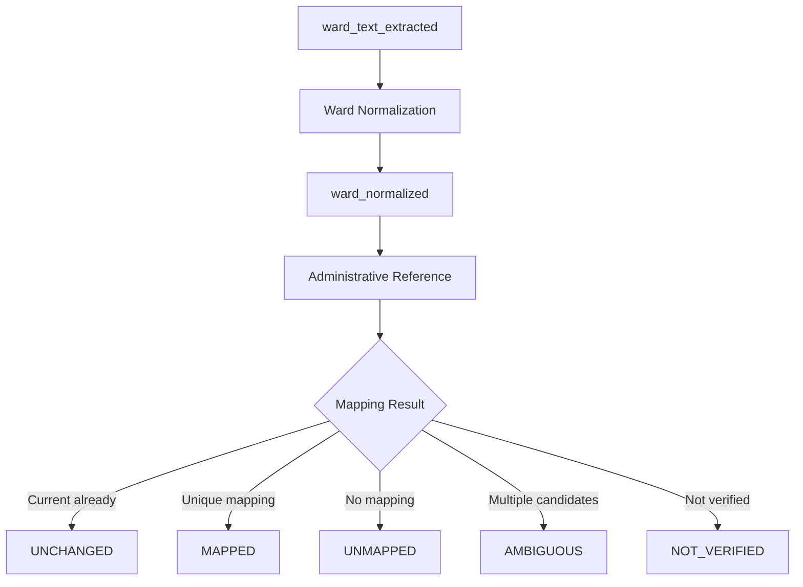
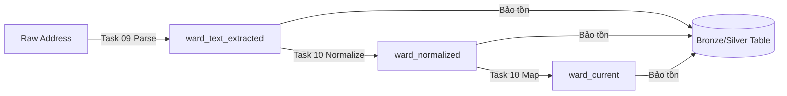
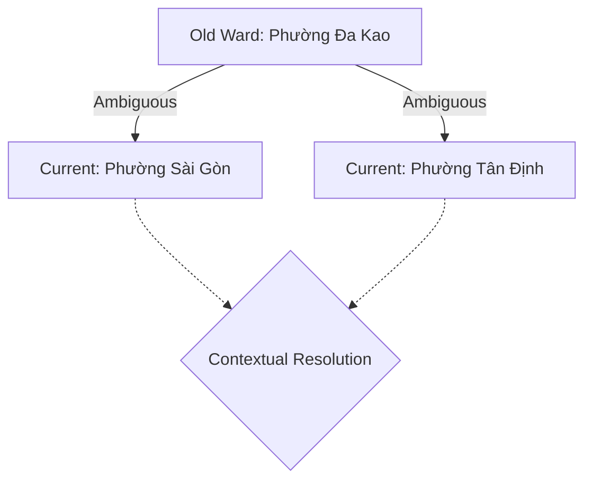
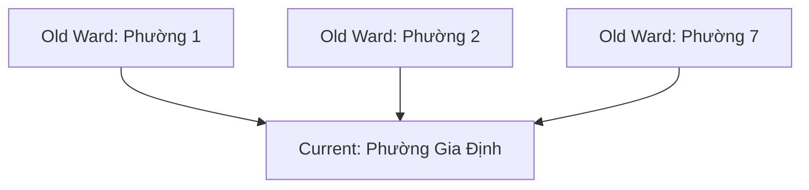
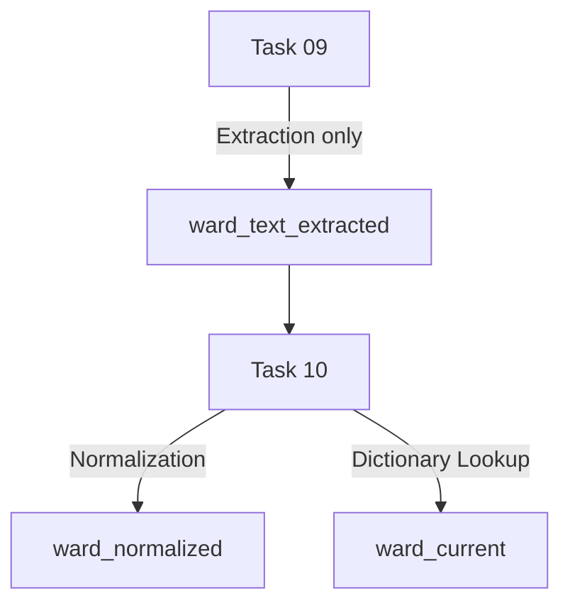

# 10 — Chuẩn hóa Phường/Xã và kiểm tra Administrative Mapping (Ward Normalization & Mapping)

## 1. Lý thuyết cốt lõi về Hành chính và Mapping

Tài liệu này giải thích chi tiết các khái niệm quan trọng để đảm bảo Data Lineage (nguồn gốc dữ liệu) và Referential Integrity (tính toàn vẹn tham chiếu) trong kiến trúc dữ liệu phân tích bất động sản.

### 1.1 Khái niệm cơ bản
- **Administrative Division (Đơn vị hành chính):** Là các vùng lãnh thổ được phân định để quản lý nhà nước.
- **Administrative Hierarchy (Cấp bậc hành chính):** Phân cấp từ lớn đến nhỏ. Ở Việt Nam: Tỉnh/Thành phố trực thuộc TW $\rightarrow$ Quận/Huyện/Thị xã $\rightarrow$ Phường/Xã/Thị trấn (Ward/Commune).
- **Ward / Commune (Phường / Xã):** Đơn vị hành chính cấp 3. Là cấp độ cơ sở phân giải địa lý quan trọng nhất trong dữ liệu bất động sản đô thị.

### 1.2 Sự khác nhau giữa Normalization và Mapping
- **Ward Normalization (Chuẩn hóa Phường/Xã):** Quá trình làm sạch văn bản, chuẩn hóa viết tắt, dấu câu, Unicode mà KHÔNG thay đổi bản chất ý nghĩa của địa danh. Ví dụ: `"P. Bến Nghé" $\rightarrow$ "Phường Bến Nghé"`.
- **Administrative Mapping (Ánh xạ Hành chính):** Quá trình chuyển đổi tên phường lịch sử (Historical Administrative Name) sang tên phường hiện tại (Current Administrative Name) do sự sáp nhập, chia tách hành chính.

### 1.3 Mapping Typology (Các kiểu ánh xạ)
- **One-to-One Mapping (Ánh xạ 1-1):** 1 Phường cũ đổi tên thành 1 Phường mới.
- **Many-to-One Mapping (Ánh xạ n-1):** Nhiều phường cũ sáp nhập thành 1 phường mới (Ví dụ: Phường 1, Phường 2, Phường 3 $\rightarrow$ Phường Mới).
- **One-to-Many Mapping (Ánh xạ 1-n):** 1 phường cũ tách thành nhiều phường mới. **Đây là nguyên nhân chính gây ra Ambiguity** nếu không có thêm bối cảnh (context) để phân giải.

### 1.4 Giải quyết sự mơ hồ và Bảo tồn dữ liệu
- **Contextual Resolution (Phân giải dựa trên ngữ cảnh):** Sử dụng các cột dữ liệu khác (như Quận, Tên đường) để quyết định trong trường hợp One-to-Many. Nếu ngữ cảnh không đủ, phải đánh dấu là `AMBIGUOUS` (Không đoán mò).
- **Vì sao không overwrite tên phường lịch sử?** Để bảo toàn **Data Lineage**. Dữ liệu gốc do người dùng nhập/crawler thu thập chứa sự thật tại thời điểm đó (Point-in-time Truth). Overwrite sẽ làm mất khả năng audit và rollback.
- **Vì sao mapping success $\neq$ mapping đúng?** Hệ thống có thể match string thành công bằng Dictionary (Lookup Succeeded), nhưng chưa chắc địa chỉ thực tế (Tọa độ địa lý) đã nằm trong phường đó. Do đó chỉ gọi là Resolved Mapping Coverage, không gọi là Accuracy.
- **Phân biệt Status:**
  - **MISSING:** Không có data đầu vào (ward_text = NULL). Khác với UNMAPPED (có text nhưng không tra cứu được).
  - **UNMAPPED:** Có text, parser chạy được, nhưng string không khớp với Reference. Khác với AMBIGUOUS (khớp với nhiều kết quả).
  - **NOT_VERIFIED:** Có mapping nhưng nguồn chưa đủ thẩm quyền (Authoritative).

---

## 2. Kiến trúc giải pháp (Mermaid Diagrams)

### DIAGRAM 01 — ADMINISTRATIVE FLOW

### DIAGRAM 02 — HISTORICAL PRESERVATION

### DIAGRAM 03 — ONE TO MANY MAPPING

### DIAGRAM 04 — MANY TO ONE MAPPING

### DIAGRAM 05 — TASK BOUNDARY

---

## 3. Runtime Results (Kết quả thực thi)

### 3.1 Bối cảnh Task 09 (Discrepancy)
`location_raw` có Parse Yield (Phường) lên tới 91k do nguồn này sử dụng breadcrumb có cấu trúc sẵn. Trong khi đó, `best_address_text` (fallback analytical) chứa rất nhiều (43k) `UNRECOGNIZED_FORMAT`. Kiểm định cho thấy Crawler đã lấy nhầm đoạn văn tự do (giá, tiện ích) vào field địa chỉ. Việc parser từ chối các string này là **hoàn toàn chính xác**, giúp bảo vệ Data Pipeline khỏi rác.

### 3.2 Thống kê Data
- **Total Runtime Listings:** `122,894`
- **Reference Table (WARD_MAPPING):** 303 entries (2 mapping 1-1, 78 mapping n-1, 39 mapping 1-n). Nguồn: Danh mục hành chính do hệ thống RoomBeacon cung cấp (WARD_MAPPING). REFERENCE_STATUS = INTERNAL_ROOMBEACON_REFERENCE. Chú ý: Đây chưa phải là authoritative external reference được kiểm chứng chính thức từ bên ngoài, do đó MAPPED/UNCHANGED mang ý nghĩa là resolved against RoomBeacon internal mapping reference (TPHCM, Vũng Tàu).
- **Ward Eligible Count:** `30,517` (Số listing có `ward_text_extracted` khả dụng trên best address).

### 3.3 Status Distribution
| Status | Số lượng | Giải thích |
| :--- | :--- | :--- |
| **MISSING** | 92,377 | Không có giá trị phường để ánh xạ (Bao gồm các ca parse lỗi ở Task 09) |
| **MAPPED** | 11,493 | Ánh xạ thành công sang tên phường hiện tại |
| **UNCHANGED** | 10,470 | Tên phường đã ở dạng chuẩn/hiện tại, không cần đổi |
| **UNMAPPED** | 6,326 | Không tìm thấy trong Dictionary |
| **AMBIGUOUS** | 2,228 | Ánh xạ One-to-Many không thể phân giải |

- **Resolved Current Ward Count (Thành công):** `21,963` (MAPPED + UNCHANGED)
- **Resolved Pct:** `17.87%` trên toàn bộ dataset (bao gồm MISSING).

### 3.4 Top Unmapped / Ambiguous
- **Top Unmapped:** Phường 2 (872), Phường 13 (812), Phường 4 (555), Phường 15 (333). Lý do: Các phường số này tồn tại ở rất nhiều quận khác nhau, nếu record không trích xuất được District chuẩn, quá trình map sẽ thất bại.
- **Top Ambiguous:** Phường 14 (296), Phường 15 (256), Phường Sơn Kỳ (222), Phường Đa Kao (218).

### 3.5 Conservation
- **Row Conservation:** PASS (Số dòng không đổi, không có Join Explosion).
- **Identity Conservation:** PASS (`rental_post_id` không đổi).

## 4. Final Decision
**ADMINISTRATIVE_MAPPING_READY**

Pipeline hoàn chỉnh cho `ward_text_extracted $\rightarrow$ ward_normalized $\rightarrow$ ward_current` đã sẵn sàng với độ an toàn cao.
