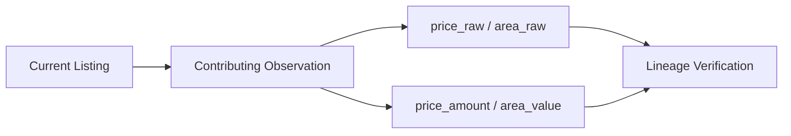
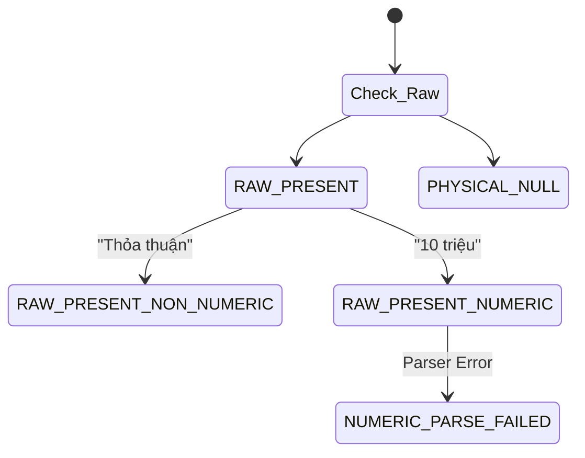
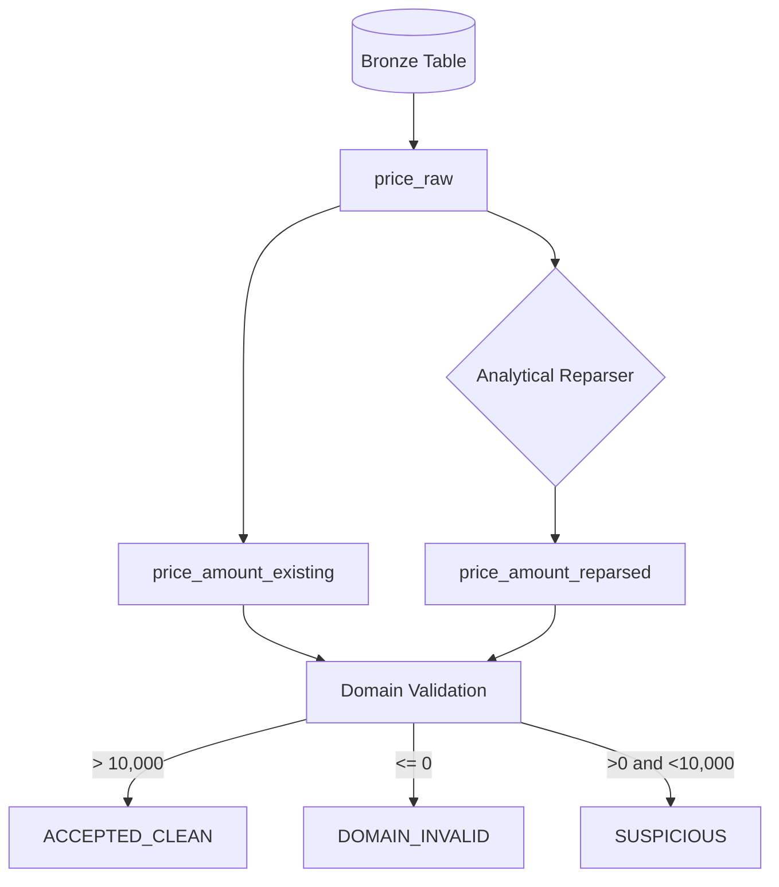
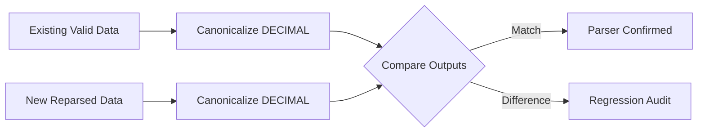
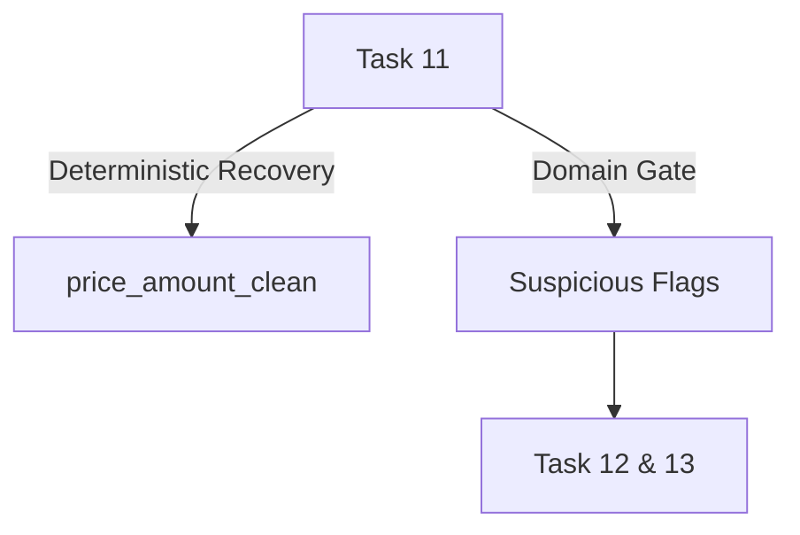

# 11 — Kiểm tra, Xác thực và Phục hồi Price / Area (Price & Area Validation and Deterministic Recovery)

## 1. Lý thuyết cốt lõi về Xác thực Dữ liệu số

### 1.1 Lineage & Observation Alignment
- **Observation (Quan sát):** Dữ liệu nhà đất là dữ liệu thay đổi theo thời gian. Mỗi lần Crawler thu thập dữ liệu về một Listing sẽ tạo ra một Observation (một phiên bản dữ liệu).
- **Data Lineage (Nguồn gốc dữ liệu):** Khả năng truy vết xem một giá trị phân tích (ví dụ: `price_amount` của bài đăng số 123) thực chất được lấy ra từ Observation nào trong quá khứ.
- **Vì sao không được lấy raw bất kỳ để nói là Parse Gap?** Nếu ta dùng `price_raw` từ ngày 01/01 nhưng lại so sánh với `price_amount` từ ngày 05/01 (khi chủ nhà đã sửa giá hoặc xóa giá), ta sẽ đánh giá sai Parser. Phải xác định Same-observation Alignment.

### 1.2 Parsing, Recovery & Domain Validation
- **Parse Gap (Lỗ hổng phân tích):** Khi dữ liệu thô (Raw) có thông tin (và thực sự mang ngữ nghĩa về một con số), nhưng dữ liệu có cấu trúc (Parsed/Analytical) lại là NULL.
- **Deterministic Recovery (Phục hồi tiền định):** Việc chạy một thuật toán Parser mới trên dữ liệu Raw nhằm khôi phục thành số liệu có cấu trúc. Cho cùng một đầu vào Raw, luôn trả về cùng một đầu ra Parsed.
- **Parse Success $\neq$ Accepted Clean:** Một string "4 đồng/tháng" có thể parse thành công ra con số `4`, nhưng không thể gọi nó là `ACCEPTED_CLEAN` được. Giá trị nhỏ phi lý như thế sẽ được gắn flag `SUSPICIOUS_FOR_TASK_13`. Việc Parse thành công và việc Pass Domain Validation là hai khâu riêng biệt!
- **Khác biệt với Imputation:** Recovery là trích xuất dữ liệu THẬT. Imputation là đoán số liệu. Task 11 tuyệt đối KHÔNG làm Imputation.
- **Unit Normalization & Compound Units:** Xử lý các dạng giá tiền phức hợp như "11 tỷ 300 triệu" đòi hỏi tính tổng (additive semantics) thay vì chỉ bắt đơn vị đầu tiên.

### 1.3 Canonicalization & Regression Testing
- **Canonical Regression Comparison:** Khi chạy hồi quy parser mới đối chiếu với parser cũ, không được so sánh text (string) hay số thập phân chưa định dạng. Phải Canonicalize cả hai về cùng Schema Type, ví dụ `DECIMAL(10,2)` cho Area và `DECIMAL(15,2)` cho Price. Ví dụ "18.999" (mới) và 19.0 (cũ) đều canonicalize ra `19.00` $\rightarrow$ MATCH.

---

## 2. Các Sơ đồ Kiến trúc (Mermaid)

### DIAGRAM 01 — LINEAGE

### DIAGRAM 02 — MISSING SEMANTICS (TỰ ĐIỀN ĐỦ)

### DIAGRAM 03 — SOURCE TRUTH & QUALITY GATE

### DIAGRAM 04 — CANONICAL REGRESSION CHECK

### DIAGRAM 05 — TASK BOUNDARY

---

## 3. Runtime Results (Quality Gate Passed)

### 3.1 Lineage & Snapshot
- **Runtime Actual:** `123,390` listings.
- **Lineage Verified:** 100%. Row & Identity Conservation PASS (Không xảy ra Join Explosion).

### 3.2 100% Reconciled Missing Breakdown
- **Price Missing:** Tổng `435` cases. Trong đó `305` là NEGOTIABLE_NON_NUMERIC (Thỏa thuận). `130` là RAW_PRESENT_NUMERIC_PARSE_FAILED. Không có Null trống.
- **Area Missing:** Tổng `497` cases. Trong đó `442` PHYSICAL_NULL (trống trơn). `52` RAW_PRESENT_NUMERIC_PARSE_FAILED. `2` RAW_PRESENT_NON_NUMERIC. `1` UNCLASSIFIED.

### 3.3 Recovery & Domain Gates
- **Price:** Reparser bắt được 130 số. Tuy nhiên sau Domain Validation, 127/130 rớt vào nhóm **SUSPICIOUS** (ví dụ "4 đồng/tháng"). Chỉ có **3 cases** được **REPARSE_ACCEPTED_CLEAN**.
- **Area:** Bắt và kiểm duyệt thành công **12 cases** được **REPARSE_ACCEPTED_CLEAN**.

### 3.4 Canonical Regression Audit (Đỉnh cao của So Sánh)
Kiểm thử Reparser mới trên toàn bộ 122,000+ records đã có dữ liệu:
- **Area:** Sau khi đưa về quy chuẩn `DECIMAL(10,2)`, lượng DIFFERENT = **0**! (Trường hợp 18.999 vs 19.00 đã được reconcile thành công bằng Canonical Scale).
- **Price:** Khác biệt 8,146 cases. Qua rà soát chi tiết bằng RegEx:
  - **COMPOUND_UNIT_OLD_PARSER_WRONG**: 7,837 cases (Ví dụ crawler cũ vứt bỏ phần "400 nghìn" trong "4 triệu 400 nghìn" và chỉ giữ 4.000.000). Reparser mới là cực kỳ chính xác.
  - **DECIMAL_SEPARATOR_DIFFERENCE**: 309 cases (Vấn đề dùng dấu phẩy/chấm).

### 3.5 Test Coverage
- **100% PASS** với 21 patterns bao gồm Compound Units, Thỏa thuận, NaN, Decimal scales.

## 4. Final Decision
**PRICE_AREA_VALIDATION_READY**

Pipeline Phục hồi và Cổng kiểm soát Chất lượng (Quality Gate) đã hoạt động trơn tru.
