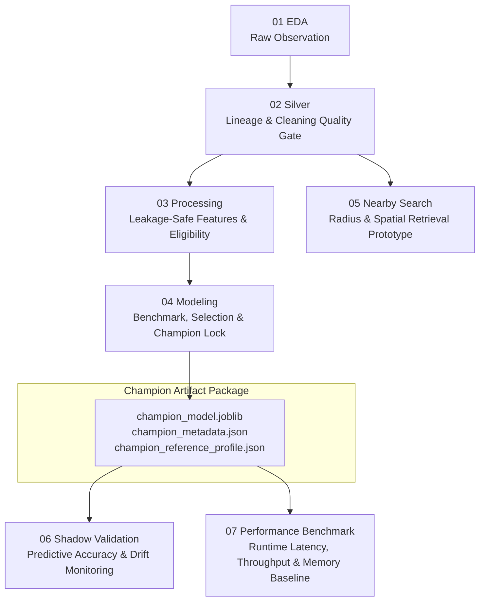

# 07 — RoomBeacon Performance Benchmark Explained

## 1. Why Notebook 07 Exists

In machine learning engineering pipelines, **model quality** and **runtime performance** are orthogonal concerns:
- **Model Quality** (Notebook 04 & 06) assesses how accurately predictions reflect real-world values (MAE, MedianAE, RMSE, $R^2$, residual bias, feature drift, segmentation error).
- **Runtime Performance** (Notebook 07) assesses how efficiently the model executes in a production-like serving environment (latency, throughput, memory footprint, cold vs. warm start, pipeline stage overhead, and scalability).

A model with excellent predictive accuracy cannot be deployed if it has unacceptable request latency or excessive memory overhead. Conversely, an ultra-fast model that outputs degenerate values is useless. Notebook 07 establishes an **empirical runtime baseline** for the frozen RoomBeacon champion (`LightGBM Regressor / RAW / F4`), answering:

> *"How efficiently does the frozen RoomBeacon champion run under realistic workloads?"*

---

## 2. Pipeline Architecture & Ownership

### Strict Architectural Boundaries
- **Notebook 04 owns training**: Fitting, hyperparameter tuning, model family comparison, and serialization of the immutable champion.
- **Notebook 06 owns shadow validation**: Scoring inference-ready rows and attaching historical actuals to audit prediction accuracy, residual distributions, and feature drift over time.
- **Notebook 07 owns runtime performance benchmarking**: Purely measuring operational efficiency, CPU/RAM utilization, and latency distributions. It **never trains, tunes, fits, or alters data**.

---

## 3. The Three Benchmark Levels

Notebook 07 organizes evaluations into three distinct levels:

| Level | Purpose | Key Workloads | Metrics Measured |
| :--- | :--- | :--- | :--- |
| **BASE** | Basic verification & sanity | 1, 100, 1,000 rows | Disk load time, feature prep time, predict time, throughput, memory delta, finite/positive prediction sanity. |
| **STANDARD** | Representative production workloads | 1, 100, 1,000, 10,000, Full batch (~129k rows) | High-res timings (`perf_counter_ns`), percentiles (P50, P90, P95, P99, Mean, Std), throughput (rows/s), unit cost (ms / 1,000 rows). |
| **ADVANCED** | Deep operational characterization | Cold vs warm, scaling, 7-stage breakdown, stability, concurrency | Cold start ratio, scaling behavior, stage bottlenecks, repeated-run CV %, memory dynamics & stability check, 8 edge-case robustness tests. |

---

## 4. Key Performance Concepts & Distinctions

### A. Hot Inference Path vs. Full Inference Pipeline
Notebook 07 measures two distinct operational timing scopes to avoid confusing callers:
- **Hot Inference Path** (measured in STANDARD & Scaling benchmarks): Evaluates the time to take pre-filtered, inference-eligible rows, construct the 4-feature numeric/categorical matrix, run LightGBM prediction, and perform inverse target transformation. On 10,000 rows, this path executes in **~37–45 ms P50**.
- **Full Inference Pipeline** (measured in Section 11 stage breakdown): Evaluates the complete, un-sanitized pipeline starting from raw Silver listings. This includes candidate column slicing, schema integrity verification, permissive inference eligibility evaluation, feature matrix construction, categorical alignment, model prediction, and output sanity validation. On 10,000 rows, this instrumented sum totals **~102–118 ms median**.
- **The Operational Difference**: The Full Inference Pipeline is slower because it additionally performs input selection, schema validation, and target-free eligibility evaluation before feature preparation and prediction. Because the Hot Path and Full Pipeline are timed as separate benchmark scopes, their numerical difference should be treated as a descriptive comparison rather than an exact additive decomposition.

### B. In-Process Single-Row Scoring vs. Batch Throughput
A common reporting error in machine learning systems is dividing full-batch execution time by row count and claiming that value as "single-request latency":
$$\text{Amortized Cost} = \frac{328\text{ ms}}{129,066\text{ rows}} \approx 0.0025\text{ ms / row} \quad (\ne \text{Single-Row Latency!})$$

In reality:
- **Warm In-Process Single-Row Scoring Latency (~6.9 ms P50)**: Measures the wall-clock duration of scoring a single row on the Hot Inference Path, dominated by pandas DataFrame initialization, category mapping, and C++ booster invocation.
  > [!NOTE]
  > This benchmark strictly measures in-process scoring. It excludes network transport, HTTP framework overhead, serialization, authentication, queueing, database/cache access, and service orchestration.
- **Batch Throughput (~390,000–495,000 rows/sec)**: Measures aggregate data processing capacity when scoring large datasets simultaneously. In batch mode, the fixed dispatch overhead is amortized across thousands of listings, and LightGBM's compiled C++ OpenMP multi-threading executes tree traversals across configured threads.

Notebook 07 explicitly decouples and reports both metrics.

### C. Cold Model Load vs. Warm Hot Path
- **Cold Model Load**: Measures disk artifact resolution $\to$ deserialization via `joblib.load` $\to$ metadata & schema verification $\to$ feature preparation $\to$ prediction within an **already-running Python interpreter** (~21 ms for 1 row, ~52 ms for 10,000 rows).
  > [!NOTE]
  > Cold Model Load does **not** measure cold process startup, container cold boot, virtual machine provisioning, or web framework (e.g., FastAPI) initialization.
- **Warm Hot Path**: The model is already resident in process RAM. Only feature matrix preparation and prediction are performed (~6.9 ms for single rows, ~328 ms for 129k rows).

### D. Repeated Prediction-Path Stability
Section 16 evaluates repeated stability by isolating the **pure prediction loop** (`prepared matrix -> model.predict -> inverse_target`) on a pre-constructed matrix across 30 consecutive iterations. This strictly isolates compiled C++ decision tree traversal variance and OS thread scheduling jitter from pandas feature allocation overhead.

### E. Latency Percentiles (P50, P90, P95, P99)
Averages (mean) mask performance outliers caused by OS thread scheduling, garbage collection, and memory page faults. Notebook 07 computes:
- **P50 (Median)**: Expected typical request latency.
- **P95 / P99**: Tail latency encountered during system contention or rare garbage collection pauses.

---

## 5. Pipeline Stage Breakdown (Where Time is Spent)

Instrumentation of the full inference path into 7 stages reveals where computational effort is allocated:

1. **Input selection**: Subsetting candidate DataFrame columns.
2. **Schema validation**: Ensuring ID uniqueness, checking presence of required fields, validating finite area values.
3. **Inference eligibility evaluation**: Target-free filtering (`area_model_suitability == 'SUPPORTED'` and rental-compatible intent).
4. **F4 feature construction**: Extracting clean area and location columns.
5. **Categorical preparation & dtype alignment**: Mapping string categories against persisted vocabularies, assigning safe `__UNKNOWN__` / `__MISSING__` sentinels, and constructing pandas categorical codes.
6. **LightGBM predict**: C++ multi-threaded decision tree traversal.
7. **Prediction sanity & post-processing**: Inverse target transform (RAW), bounds verification, and ID attachment.

**Key Finding**: In batch workloads, LightGBM tree prediction accounts for only ~20% of full pipeline time; data preparation, categorical encoding, and eligibility filtering account for the remaining ~80%. Optimizations to data handling yield larger gains than optimizing tree depth.

---

## 6. Stable Memory Profile

Process memory is measured using Resident Set Size (**RSS**) via `psutil`:
- **Model Load Delta**: Loading the serialized LightGBM champion adds only ~4–6 MB to process RSS.
- **Batch Peak Delta**: Scoring the entire 129k population requires ~15–20 MB of temporary memory for DataFrame matrix allocations.
- **Memory Assessment**: No material persistent RSS growth was observed across the measured repeated-run window (RSS delta across 15 repeated 10k batch cycles was +0.00 MB).

---

## 7. Hardware & Configuration Dependency

Benchmark results are inherently bound to the execution environment (CPU clock frequency, cache hierarchy, core count, RAM bandwidth). To ensure reproducibility across different machines:
- **Environment Fingerprint**: Notebook 07 captures an OS/hardware/library fingerprint hash and records logical/physical core counts, total RAM, and library versions.
- **CPU & Thread Configuration**: The benchmark environment records static threading parameters (e.g. `num_threads`, `n_jobs`, logical/physical core counts, process CPU affinity). Runtime CPU core utilization is not directly sampled; high throughput reflects OpenMP batch acceleration without implying specific thread saturation claims.
- **Deterministic Workloads**: Workload samples are drawn with fixed seed `BENCHMARK_RANDOM_SEED = 42`.
- **Append-Only Artifacts**: Benchmark runs are saved with unique timestamped IDs under `data/modeling/performance_benchmark/runs/<run_id>/` with SHA-256 manifests.

---

## 8. Why No Arbitrary Performance SLA is Applied

It is bad practice to invent arbitrary pass/fail thresholds (e.g. `P95 < 15ms` or `throughput > 500k`) without formal product requirements. 

Notebook 07 adopts a **MEASURE-FIRST** methodology:
- Baseline status is classified as **`IN-PROCESS PERFORMANCE BASELINE = ESTABLISHED`**.
- It provides documented, empirical benchmarks that engineering and product teams can consult when drafting production Service Level Objectives (SLOs).
- **Concurrency Trade-Off**: Higher multi-worker concurrency via `ThreadPoolExecutor` increases aggregate throughput while also increasing per-request latency, consistent with shared CPU/thread scheduling, resource contention, and possible nested parallelism (without asserting isolated GIL causality).

---

## 9. Model Quality vs. Runtime Performance (Orthogonal Axes)

Model quality metrics and runtime metrics are evaluated independently:
- **Model Quality (from Benchmark V3 `final_test.csv`)**:
  - Test MAE: `904,290.83 VND` (Baseline Improvement: `63,878.25 VND`)
  - Test MedianAE: `624,464.82 VND`
  - Test RMSE: `1,333,621.37 VND`
  - Test $R^2$: `0.2241`
- **In-Process Runtime Performance (Notebook 07)**:
  - Warm in-process single-row scoring latency (Hot Path P50): `~6.9 ms`
  - 10,000-row Hot Path P50: `~44.7 ms` (Full Pipeline: `~102.2 ms`)
  - Full batch (129,066 rows) Hot Path P50: `~328.6 ms` (`~392,784 rows/s`)
  - Cold Model Load Single-row P50: `~21.3 ms` (10k rows: `~51.9 ms`)
  - Repeated Prediction Path Stability CV: `< 25%`
  - Robustness: 8/8 valid edge cases PASS without exception or invalid prediction.
