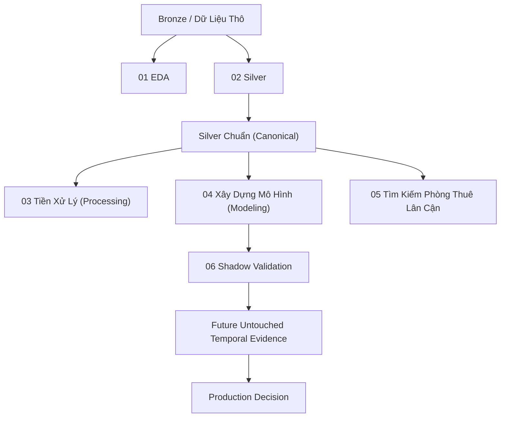

# Pipeline Notebook RoomBeacon — Kiến Trúc Tổng Thể và Cẩm Nang Debug

Bộ tài liệu này cung cấp tài liệu kỹ thuật chi tiết theo từng cell và cẩm nang gỡ lỗi (debug) cho toàn bộ pipeline khoa học dữ liệu và học máy của RoomBeacon (từ Notebook 01 đến 06).

Tài liệu được biên soạn dành cho các lập trình viên, kỹ sư dữ liệu và chuyên viên ML cần hiểu, bảo trì hoặc debug bất kỳ phần nào của pipeline mà không phải đảo ngược mã nguồn (reverse-engineer) nhiều lần.

---

## 1. Mục Lục Bộ Tài Liệu

Bộ tài liệu được tổ chức thành 7 tài liệu chuyên biệt:

| Tài liệu | Notebook tương ứng | Mục đích chính | Artifacts chính |
| :--- | :--- | :--- | :--- |
| [README.md](./README.md) | Toàn bộ suite (01–06) | Kiến trúc tổng quan, các hợp đồng ràng buộc và quy trình debug | Sơ đồ kiến trúc hệ thống |
| [01_eda_explained.md](./01_eda_explained.md) | `01_roombeacon_eda.ipynb` | Kiểm toán quan sát dữ liệu trên snapshot Bronze thô | Đường cơ sở chất lượng, kiểm toán trường |
| [02_silver_explained.md](./02_silver_explained.md) | `02_roombeacon_silver.ipynb` | Chuyển đổi dữ liệu chuẩn hóa từ Bronze sang Silver có kiểm toán | `rental_listings.parquet`, metadata |
| [03_processing_explained.md](./03_processing_explained.md) | `03_roombeacon_processing.ipynb` | Tầng phân tích hậu Silver và hợp đồng đặc trưng an toàn | Định nghĩa các tập đặc trưng an toàn (F1–F5) |
| [04_modeling_explained.md](./04_modeling_explained.md) | `04_roombeacon_modeling.ipynb` | Benchmark V3 và khóa LightGBM/RAW/F4 | CSV benchmark, champion artifact/reference |
| [05_nearby_rental_search_explained.md](./05_nearby_rental_search_explained.md) | `05_roombeacon_nearby_rental_search.ipynb` | Nguyên mẫu tìm kiếm không gian và thẩm định sản phẩm | Các file CSV đánh giá tìm kiếm, phễu tìm kiếm |
| [06_shadow_validation_explained.md](./06_shadow_validation_explained.md) | `06_roombeacon_shadow_validation.ipynb` | Inference/monitoring champion đã khóa, không training | Append-only shadow runs, drift/error/readiness |

---

## 2. Luồng Dữ Liệu và Kiến Trúc Khái Niệm

Pipeline RoomBeacon tuân thủ kiến trúc phân tầng Medallion nghiêm ngặt:



### Vai Trò Kiến Trúc của Từng Giai Đoạn

1. **Tầng Bronze / Dữ liệu thô (`data/bronze/snapshot/`)**
   - Được trích xuất trực tiếp từ cơ sở dữ liệu vận hành MySQL (`roombeacon_bronze`).
   - Lưu trữ dưới dạng checkpoint phân tích tại một thời điểm (`latest_posts.parquet` và `raw_evidence.parquet`).
   - Đại diện cho 132.436 tin đăng thô được thu thập từ nhiều cổng thông tin (phongtro123, chothuephongtro, cafeland, mogi, nhatot, muaban, nhatrovn, tromoi, chothuenha).
   - Khung thời gian snapshot: 2026-09-20 12:48:44 đến 2026-09-30 10:42:53 (~10 ngày).

2. **Notebook 01: Phân tích Khám phá Dữ liệu (`01_roombeacon_eda.ipynb`)**
   - **Chế độ:** Kiểm toán quan sát chỉ đọc (read-only).
   - **Tác vụ:** Kiểm toán tính nhất quán của schema thô, tính toàn vẹn của khóa chính, URL trùng lặp, quy luật đồng thiếu dữ liệu, ngoại lai số học, dị thường trong biểu diễn văn bản, vấn đề sáp nhập hành chính phường/xã, và lỗi biên tọa độ.
   - **Hợp đồng:** Không tạo ra dataset ghi đè hay dataset mới trên đĩa. Tạo lập cơ sở thực nghiệm để thiết kế các quy tắc làm sạch, phân tích cú pháp và cổng kiểm soát chất lượng trong Notebook 02.

3. **Notebook 02: Chuyển đổi Bronze sang Silver có Kiểm toán (`02_roombeacon_silver.ipynb`)**
   - **Chế độ:** Động cơ chuyển đổi dữ liệu sản xuất và kiểm soát chất lượng.
   - **Tác vụ:** Làm giàu dữ liệu tin đăng thô bằng cách chuẩn hóa văn bản, phân tích địa chỉ thành phân cấp hành chính (đường, phường, quận, tỉnh), ánh xạ phường về ranh giới hành chính hiện hành, xác thực giá và diện tích đối chiếu với bằng chứng thô của crawler, phân loại độ tin cậy tọa độ, và gom cụm tin trùng lặp bằng thuật toán Union-Find.
   - **Bất biến cốt lõi:** Bảo toàn 100% số dòng (vào 132.436 dòng $\rightarrow$ ra 132.436 dòng). Không có bản ghi thô nào bị âm thầm xóa bỏ hoặc sửa đổi tại chỗ; các trạng thái chất lượng và độ tin cậy được gắn thêm vào cột mới.
   - **Đầu ra:** Dataset Silver chuẩn hóa (`data/silver/rental_listings.parquet` và `rental_listings.metadata.json`).

4. **Dataset Silver Chuẩn Hóa (`data/silver/rental_listings.parquet`)**
   - Nguồn chân lý duy nhất (Single Source of Truth) cho toàn bộ các ứng dụng phân tích, mô hình hóa và tìm kiếm phía sau.
   - Gồm 80 cột: bảo toàn nguyên vẹn 20 cột Bronze thô ban đầu, cộng thêm 60 trường dữ liệu sạch, đã bóc tách, đã ánh xạ và gắn cờ trạng thái kiểm toán.

5. **Notebook 03: Hậu Xử Lý Silver và Hợp Đồng Đặc Trưng (`03_roombeacon_processing.ipynb`)**
   - **Chế độ:** Thẩm định phân tích trên bộ nhớ và công bố hợp đồng đặc trưng an toàn.
   - **Tác vụ:** Thiết lập các tập đặc trưng dự đoán an toàn (từ F1 đến F5) từ các trường Silver, định nghĩa các biến chỉ dùng cho chẩn đoán (ví dụ: `price_per_area_analysis`, `distance_km_analysis`), và kiểm tra rào chắn chống rò rỉ dữ liệu (leakage guards) bằng mã lệnh.
   - **Bất biến cốt lõi:** Không chia tập (split-free) và không lưu trữ dư thừa. Notebook này không chia dữ liệu thành tập train/test và không ghi file Parquet dư thừa ra đĩa. Notebook 04 nắm giữ độc quyền quyền phân chia dữ liệu theo thời gian và nhóm.

6. **Notebook 04: Benchmark Định Giá Cho Thuê V3 (`04_roombeacon_modeling.ipynb`)**
   - **Chế độ:** Động cơ đánh giá và benchmark mô hình học máy.
   - **Tác vụ:** Xác định biến mục tiêu kinh doanh (`price_model_value`), lọc quần thể cho thuê thông thường hợp lệ, phân chia dữ liệu theo trình tự thời gian nhận thức nhóm (70% train, 15% validation, 15% test niêm phong), chạy 3 fold phát triển cửa sổ mở rộng trên 11 thuật toán mô hình và 2 phép biến đổi mục tiêu (RAW so với LOG1P), khóa ứng viên bất biến theo quy tắc phạt độ phức tạp, và thực thi một lần đánh giá duy nhất trên tập TEST niêm phong.
   - **Đầu ra:** Bằng chứng thực nghiệm và champion **LightGBM Regressor / RAW / F4** được lưu tại `data/modeling/roombeacon_price_benchmark_v3/`, gồm CSV/Parquet benchmark, `experiment_metadata.json`, model binary, champion metadata và development-only reference profile.

7. **Notebook 05: Nguyên Mẫu Tìm Kiếm Phòng Thuê Lân Cận (`05_roombeacon_nearby_rental_search.ipynb`)**
   - **Chế độ:** Thẩm định sản phẩm thu hồi và phát hiện không gian.
   - **Tác vụ:** Truy vấn trực tiếp Silver Parquet chuẩn, lọc tin đăng tương thích cho thuê, kiểm toán độ tin cậy tọa độ (nhận diện chỉ 1,72% tin có tọa độ tin cậy), thực thi phân loại vị trí 5 trạng thái, tính khoảng cách Haversine vector hóa nghiêm ngặt trên tọa độ được xác thực, cung cấp các tầng dự phòng (Cùng Phường, Cùng Quận), và đánh giá giá thuê thị trường theo các vành đai bán kính đồng tâm.
   - **Đầu ra:** Phễu tìm kiếm, phân tích thị trường và kết quả chẩn đoán được lưu tại `data/analysis/nearby_search/`.

8. **Notebook 06: Shadow Validation (`06_roombeacon_shadow_validation.ipynb`)**
   - **Chế độ:** Inference và monitoring; không huấn luyện hay chọn lại model.
   - **Tác vụ:** Nạp champion LightGBM/RAW/F4 đã khóa, tái sử dụng eligibility contract, xác thực schema/unknown category, chạy prediction không target, rồi theo dõi drift, error slices, prediction compression và readiness.
   - **Đầu ra:** Run bất biến theo ID tại `data/modeling/shadow_validation/runs/`. Snapshot hiện tại là `HISTORICAL_DRY_RUN` và không được tính là bằng chứng production mới.

---

## 3. Các Bất Biến Toàn Cục Của Pipeline

Mọi lập trình viên làm việc trên RoomBeacon phải tuân thủ 4 bất biến cốt lõi:

### Bất biến 1: Silver Parquet Chuẩn Là Nguồn Chân Lý Duy Nhất
Các notebook phía sau (03, 04, 05, 06) tuyệt đối không được đọc dữ liệu Bronze thô, không truy vấn cơ sở dữ liệu MySQL trực tiếp, và không chỉnh sửa file `data/silver/rental_listings.parquet`. Mọi bước tạo đặc trưng, lọc điều kiện và thuật toán truy xuất phải tái lập xác định từ file Silver Parquet.

### Bất biến 2: Hợp Đồng Chống Rò Rỉ Dữ Liệu (Anti-Leakage)
Thông tin mục tiêu không bao giờ được phép xuất hiện trong ma trận đặc trưng đầu vào của mô hình.
- `price_model_value` là biến mục tiêu cần dự đoán.
- Các chỉ số phái sinh từ mục tiêu như `price_per_area_analysis`, các trường giá thô (`price_amount`, `price_raw`, `price_reparsed`), khóa chính (`rental_post_id`), và khóa nhóm (`duplicate_candidate_group`) tuyệt đối bị cấm làm biến dự đoán.
- Notebook 03/04 cưỡng chế điều này qua `audit_features`; Notebook 06 còn buộc feature order đúng F4 và chỉ join actual theo ID sau prediction.

### Bất biến 3: Cô Lập Nhóm và Chia Tập Nghiêm Ngặt Theo Thời Gian
Các tin đăng bất động sản thường xuyên được đăng lại (repost) hoặc sao chép qua các cổng thông tin khác nhau. Nếu cùng một tin đăng xuất hiện ở cả tập train và tập test, các chỉ số đánh giá sẽ bị lạc quan giả tạo.
- Toàn bộ các tin đăng thuộc cùng một `duplicate_candidate_group` (hoặc `rental_post_id` đối với tin đơn lẻ) bắt buộc phải được xếp vào cùng một phân vùng.
- Việc phân chia dựa trên mốc thời gian quan sát muộn nhất của nhóm (`latest_observed_at`). Dữ liệu tương lai không bao giờ được rò rỉ vào các fold trong quá khứ.

### Bất biến 4: Không Làm Giả Tọa Độ Hay Khoảng Cách Địa Lý
Khoảng cách địa lý (`distance_km`) được tính bằng công thức Haversine **chỉ khi cả điểm tham chiếu và tin đăng đều có tọa độ hợp lệ, đáng tin cậy** (`has_trusted_coordinate == True`).
- Nếu tọa độ bị thiếu, bằng 0, nằm ngoài ranh giới, từ nhà cung cấp không tin cậy, hoặc nằm tại điểm mặc định chung của cổng thông tin (hotspot), khoảng cách bắt buộc phải là `NaN` / `None`.
- Tuyệt đối không làm giả hoặc nội suy khoảng cách địa lý bằng cách gán tọa độ tâm phường hoặc tâm quận.

---

## 4. Sơ Đồ Module Tiện Ích (`notebooks/utils/`)

Notebook 01 đến 06 ủy thác các logic nghiệp vụ phức tạp cho các module tiện ích dùng lại trong thư mục `notebooks/utils/`:

```
notebooks/utils/
├── address_cleaner.py          # Làm sạch chuỗi địa chỉ tầng thấp và chuẩn hóa khoảng trắng
├── address_parser.py           # Bộ bóc tách địa chỉ tiếng Việt bằng Regex (đường, phường, quận, tỉnh)
├── area_validator.py           # Phân tích cú pháp diện tích và bóc tách m²
├── data_quality.py             # Các chỉ số hồ sơ dữ liệu và bảng tóm tắt dùng lại
├── eda_field_audit.py          # Từ điển kiểm toán trường và lược đồ cho Notebook 01
├── eda_processing.py           # Tính toán mối quan hệ giữa các trường và tổng hợp hai biến
├── eda_visualization.py        # Tiện ích trực quan hóa (Plotly/Matplotlib wrappers) cho Notebook 01
├── listing_semantics.py        # Phân loại ý định tin đăng (THUÊ/BÁN/SANG NHƯỢNG) và phạm vi cho thuê
├── location_analysis.py        # Kiểm thực tọa độ, kiểm toán nhà cung cấp và khoảng cách Haversine
├── location_normalizer.py      # Tiện ích chuẩn hóa chuỗi đơn vị hành chính
├── modeling_benchmark.py       # Động cơ ML: chia tập, fold mở rộng, chỉ số, khóa ứng viên, danh mục
├── nearby_rental_search.py     # Động cơ tìm kiếm không gian: phân loại 5 trạng thái, xếp hạng, phễu
├── notebook_audit.py           # Mặt nạ thiếu dữ liệu, xác thực giá trị số và kiểm tra tính toàn vẹn
├── price_area_validation.py    # Bóc tách giá phức tạp (triệu, tỷ, k), kiểm tra dòng dõi và logic tin cậy
├── price_validator.py          # Tiện ích phân tích cú pháp giá bằng regex
├── project_path.py             # Thiết lập sys.path linh hoạt giúp chạy notebook từ bất kỳ thư mục nào
├── silver_processing.py        # Biến đổi Bronze sang Silver tất định và kiểm tra cổng chất lượng
├── silver_reporting.py         # Báo cáo tóm tắt, phân phối trạng thái và chênh lệch thay đổi văn bản
├── shadow_validation.py        # Artifact contract, inference, drift, error slices và append-only runs
├── text_standardization.py     # Chuẩn hóa Unicode NFC và làm sạch khoảng trắng
└── ward_normalization.py       # Chuẩn hóa danh mục phường TP.HCM và ánh xạ lại đơn vị hành chính
```

---

## 5. Quy Trình Vận Hành và Debug Dành Cho Lập Trình Viên

### Thiết Lập Môi Trường và Runtime
Để chạy hoặc debug bất kỳ notebook nào trong pipeline:
1. Đảm bảo môi trường ảo Python 3.12 đã được kích hoạt:
   ```bash
   source /data/projects/roombeacon/source/roombeacon-system/venv/bin/activate
   ```
2. Kiểm tra kết nối DuckDB và Parquet:
   ```bash
   python -c "import duckdb; print(duckdb.__version__)"
   ```
3. Đặt thư mục làm việc hiện tại là thư mục gốc của repository (`/data/projects/roombeacon/source/roombeacon-system`) hoặc thư mục `notebooks/`. Mọi notebook đều sử dụng `notebooks.utils.project_path` hoặc duyệt cây thư mục cha để tự động nhận diện `PROJECT_ROOT`.

### Trình Tự Thực Thi Khuyến Nghị

```
Bước 1: Kiểm tra 01_roombeacon_eda.ipynb (Chỉ đọc, xác nhận sức khỏe dữ liệu Bronze)
   │
Bước 2: Chạy 02_roombeacon_silver.ipynb (Tạo ra Canonical Silver Parquet)
   │
   ├── Bước 3: Chạy 03_roombeacon_processing.ipynb (Kiểm thực hợp đồng đặc trưng an toàn)
   │      │
   │      └── Bước 4: Chạy 04_roombeacon_modeling.ipynb (Benchmark và persist champion)
   │             │
   │             └── Bước 6: Chạy 06_roombeacon_shadow_validation.ipynb (Load/infer/monitor)
   │
   └── Bước 5: Chạy 05_roombeacon_nearby_rental_search.ipynb (Chạy nguyên mẫu tìm kiếm không gian)
```

### Bảng Kiểm Tra Sự Cố Thường Gặp (Troubleshooting)

| Triệu chứng / Lỗi | Nguyên nhân tiềm ẩn | Biện pháp xử lý / Debug |
| :--- | :--- | :--- |
| `FileNotFoundError: Canonical Silver not found` | Notebook 02 chưa được chạy hoặc gặp lỗi trước khi ghi Parquet. | Kiểm tra `data/silver/`. Chạy lại Notebook 02 để tạo file `rental_listings.parquet`. |
| `SilverQualityGateError: ...` trong Notebook 02 | Snapshot Bronze bị lỗi, thiếu khóa chính, hoặc schema bị lệch. | Kiểm tra `data/bronze/snapshot/metadata.json`. Xác minh `latest_posts.parquet` khớp với `raw_evidence.parquet`. |
| `ValueError: Forbidden/leaking predictors` trong Notebook 03/04 | Một tập đặc trưng chứa `price_*`, `rental_post_id`, hoặc `group_key`. | Kiểm tra danh sách đặc trưng truyền vào `audit_features`. Chỉ sử dụng các biến nằm trong danh mục `FULL_SAFE_FEATURES`. |
| `ImportError: cannot import name 'prepare_lightgbm_categories'` trong Notebook 04 | Output lưu của Cell 02 phản ánh phiên bản cũ trước commit `7114a33`. | Hàm đã có trong `notebooks.utils.modeling_benchmark`. Khởi động lại kernel và import lại. Không cần chạy lại toàn bộ notebook mô hình tốn kém tài nguyên. |
| `ValueError: Invalid reference coordinate pair` trong Notebook 05 | Tọa độ tham chiếu bị vượt biên hoặc bằng (0,0). | Kiểm tra `REFERENCE_LATITUDE` và `REFERENCE_LONGITUDE` trong Mục 2 của Notebook 05. Cần dùng tọa độ hợp lệ tại TP.HCM (ví dụ: 10.7725, 106.6578). |
| Kết quả tìm kiếm chính xác rỗng trong Notebook 05 | Ngưỡng lọc (`MIN_PRICE`, `MAX_PRICE`, `MIN_AREA`, `MAX_AREA`) quá hẹp hoặc bán kính tìm kiếm quá nhỏ. | Kiểm tra cấu hình Mục 2 Notebook 05. Tăng `SEARCH_RADIUS_KM` (ví dụ từ 1.0 lên 3.0 hoặc 5.0 km) hoặc nới lỏng bộ lọc giá/diện tích. |
| `serialized champion pointer` trong Notebook 06 | Benchmark có metadata nhưng chưa publish model binary. | Chạy đúng đường persist champion đã khóa của Notebook 04; không instantiate model tùy ý trong 06. |
| `Champion ... disagreement` trong Notebook 06 | Model binary, metadata, feature contract hoặc SHA-256 lệch nhau. | Dừng inference và tái tạo package từ champion đã khóa; không bỏ qua assertion. |

---

## 6. Tổng Hợp Các Artifact Của Pipeline

```
data/
├── bronze/
│   └── snapshot/
│       ├── latest_posts.parquet       # Snapshot mới nhất thô (132.436 dòng)
│       ├── raw_evidence.parquet       # Bằng chứng chuỗi giá & diện tích thô (132.436 dòng)
│       └── metadata.json              # Hash snapshot, nhãn thời gian và kiểm kê cột
├── silver/
│   ├── rental_listings.parquet        # Silver Parquet chuẩn (132.436 dòng, 80 cột, 32.4 MB)
│   └── rental_listings.metadata.json  # Schema 2.1.0, tóm tắt kiểm toán chất lượng, hash dòng dõi
├── modeling/
│   └── roombeacon_price_benchmark_v3/
│       ├── development_comparison.csv # Kết quả cross-validation trên 11 mô hình và RAW/LOG1P
│       ├── f4_f5_decision.csv         # Bằng chứng quyết định chọn tập đặc trưng F4 thay vì F5
│       ├── final_test.csv             # Đánh giá một lần duy nhất trên tập TEST niêm phong
│       ├── final_verdict.csv          # Kết luận đánh giá toàn diện, mức cải thiện, tính sẵn sàng
│       ├── test_predictions.parquet   # Dự đoán ngoài mẫu trên tập test (1.04 MB)
│       ├── champion_model.joblib      # LightGBM/RAW/F4 đã fitted và khóa
│       ├── champion_metadata.json     # Inference/schema/vocabulary/hash contract
│       ├── champion_reference_profile.json # Development-only drift reference
│       └── experiment_metadata.json   # Cấu hình thử nghiệm đầy đủ, phiên bản và thời gian chạy
│   └── shadow_validation/
│       ├── runs/<run_id>/             # Run bất biến: prediction, metrics, drift, manifest
│       └── summary/run_index.csv      # Chỉ mục append-friendly
└── analysis/
    └── nearby_search/
        ├── location_quality_summary.csv    # Độ phủ tọa độ và phân bố hotspot mặc định
        ├── search_coverage_funnel.csv      # Phễu thu hồi từ 131k tin đăng đến các vành đai bán kính
        ├── radius_market_summary.csv       # Giá thuê/diện tích thị trường theo bán kính (<=1, 3, 5, 10 km)
        ├── nearby_search_exact_results.csv # Danh sách tin đăng khoảng cách chính xác trong bán kính
        ├── same_ward_fallback_results.csv  # Tin đăng dự phòng hành chính cùng phường tham chiếu
        ├── same_district_fallback_results.csv # Tin đăng dự phòng hành chính cùng quận tham chiếu
        └── search_run_metadata.json        # Tham số chạy, phân bố phân loại vị trí, tính sẵn sàng
```
