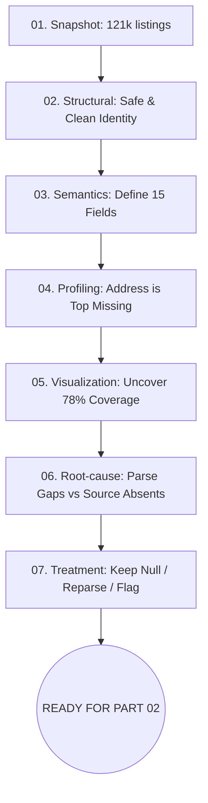

# RoomBeacon — PART 01 Summary

Tài liệu này tóm tắt toàn bộ phát hiện của **PART 01: DATA UNDERSTANDING & DATA QUALITY AUDIT**.

## 01. Dataset hiện tại (Inventory & Snapshot)
- **Runtime Rows:** 121,929 current rental listings (bản ghi bất động sản đang cho thuê).
- **Columns:** 15 trường phân tích chính tại view `v_latest_posts`.
- **Sources:** Dữ liệu đến từ 9 nguồn thu thập (ví dụ: phongtro123, chothuephongtro, cafeland...).

## 02. Structural status
- Dataset được xác nhận **STRUCTURALLY_SAFE_FOR_EDA**.
- Không có lỗi trùng lặp (Duplicate) trên composite key `(source_code, source_listing_id)`. Identity của bản ghi được bảo toàn hoàn hảo 100%.

## 03. Missing status (Top Missing Fields)
- `full_address_text`: Mất 89,174 rows (~73%).
- `location_raw`: Mất 26,753 rows (~21.9%).
- `best_address_text`: Mất 26,591 rows (~21.8%).
- `price_amount`: Mất 516 rows (~0.4%).
- `area_value`: Mất 487 rows (~0.4%).
- Nhóm Identity và Temporal: Mất 0%. Hoàn chỉnh tuyệt đối.

## 04. Address Semantics (Ngữ nghĩa Địa chỉ)
Hệ thống RoomBeacon tách bạch rõ ràng 3 lớp địa chỉ, không được phép gộp chung:
- **Detailed Address (`full_address_text`)**: Địa chỉ có số nhà, ngõ, ngách.
- **Lightweight Location (`location_raw`)**: Vị trí thô lấy từ source card (thường chỉ tới mức Phường/Quận).
- **Best Available Address (`best_address_text`)**: Lớp phái sinh (Fallback) chọn lựa thông tin địa chỉ tốt nhất hiện có.

## 05. Root-cause Evidence (Chẩn đoán nguyên nhân rỗng)
- **Parse Gap (CONFIRMED):** 100% (516) ca mất `price_amount` là do Parser, trong khi `price_raw` ở tầng Bronze vẫn tồn tại.
- **No Raw Evidence (CONFIRMED):** Hầu hết (434/487) ca mất `area_value` là do Website gốc thực sự không cung cấp thẻ diện tích thô.
- **Source Absent / Hết Fallback (CONFIRMED):** 26,591 ca mất `best_address_text` do thiếu toàn bộ raw evidence tại Pipeline hiện hành (chủ yếu từ `phongtro123`).

## 06. Treatment principles (Nguyên tắc xử lý)
- **Bảo vệ Source Truth:** Không giả tạo (fabricate) dữ liệu. Không dùng fillna với các giá trị thống kê (Mean/Median) để ghi đè Source Fact.
- **Data Deletion is not Cleaning:** Không xóa bản ghi chỉ vì thiếu một trường (ví dụ: thiếu diện tích). Thay vào đó, áp dụng loại trừ theo từng phép phân tích cụ thể (Analysis-specific Exclusion).
- **Reparse thay vì Impute:** Sẽ tiến hành khôi phục Deterministic từ dữ liệu Raw cho các biến bị Parse Gap.

## 07. Remaining issues (Các vấn đề còn đọng lại)
- Lỗi logic thời gian (Temporal Inconsistency): Một số bài đăng có `first_observed_at` > `last_observed_at`.
- Thiếu hoàn toàn địa chỉ ở khoảng ~26k bài đăng. (Cần External Geocoding/Enrichment).

## 08. Readiness for PART 02
Toàn bộ Part 01 đã chuẩn bị đủ contract, rule, flag và insight để thiết kế Data Cleaning Pipeline. 
Quyết định kỹ thuật: **PART_01_READY_FOR_PART_02** (PASS).

## 09. Mermaid Tổng Flow PART 01

