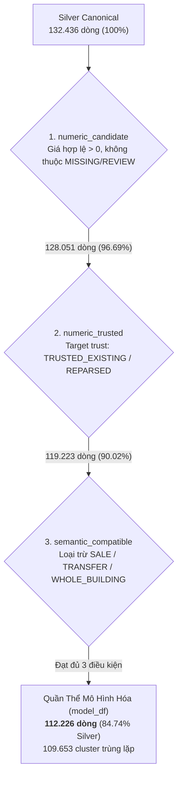

# Báo Cáo Kiến Trúc Phân Vùng Huấn Luyện (TRAIN Partition Architecture)

Tài liệu kỹ thuật này mô tả chi tiết kiến trúc, quy luật phân chia dữ liệu, cơ chế chống rò rỉ (leakage-safe), và bản chất phân vùng của tập dữ liệu huấn luyện (**TRAIN**) trong hệ thống RoomBeacon (đặc biệt tại [04_roombeacon_modeling.ipynb](../04_roombeacon_modeling.ipynb)).

---

## 1. Bản Chất Lưu Trữ Vật Lý (Physical vs In-Memory Reality)

> [!IMPORTANT]
> **Không có bất kỳ file `train.parquet` hay `train_df.parquet` nào được lưu trữ cố định trên đĩa.**

Trong kiến trúc của RoomBeacon:
1. **Single Source of Truth (SSOT):** Toàn bộ dữ liệu sạch duy nhất được lưu tại `data/silver/rental_listings.parquet` (132.436 dòng).
2. **Không phân mảnh dữ liệu (Zero Data Sprawl):** RoomBeacon kiên quyết không tạo ra các file Parquet phân mảnh dư thừa (như `train.parquet`, `val.parquet`, `test.parquet`) trên ổ đĩa. Việc này nhằm tránh hiện tượng lệch pha dữ liệu (data drift), xung đột phiên bản, hoặc rò rỉ dữ liệu ngoài tầm kiểm soát.
3. **Tái tạo tất định trong bộ nhớ (Deterministic In-Memory Split):** Phân vùng TRAIN được sinh ra hoàn toàn trong RAM máy chủ tại thời điểm thực thi **Cell 06** của Notebook 04 thông qua các hàm có seed cố định (`SEED = 42`) và thuật toán sắp xếp ổn định (`mergesort`).

---

## 2. Phễu Lọc Quần Thể Mô Hình Hóa (Modeling Population Funnel)

Trước khi tiến hành phân chia tập huấn luyện, dữ liệu phải trải qua phễu kiểm định ngữ nghĩa và độ tin cậy mục tiêu tại **Cell 04**:



- **Tổng dòng Silver chuẩn hóa:** 132.436 dòng.
- **Quần thể đủ điều kiện mô hình hóa (`model_df`):** **112.226 dòng** (chiếm 84,74% Silver).
- **Số nhóm duy nhất (`group_key`):** **109.653 nhóm** (mỗi nhóm đại diện cho một cụm tin đăng trùng lặp `duplicate_candidate_group` hoặc một tin đơn lẻ).

---

## 3. Phân Vùng Tĩnh Ban Đầu (`group_aware_split` 70 / 15 / 15)

Tại Cell 06, hàm `group_aware_split` phân chia 109.653 nhóm dữ liệu theo tỷ lệ lý thuyết 70% Train, 15% Validation, 15% Test dựa trên thứ tự thời gian (`latest_observed_at`):

| Phân vùng tĩnh | Số dòng (Rows) | Tỷ lệ dòng | Số nhóm (Groups) | Tỷ lệ nhóm | Trạng thái bảo vệ |
| :--- | :---: | :---: | :---: | :---: | :--- |
| **TRAIN (Static)** | **77.522** | 69,08% | **76.760** | 70,00% | Huấn luyện cơ sở |
| **VALIDATION (Static)** | **18.209** | 16,23% | **16.445** | 15,00% | Đánh giá trung gian |
| **TEST (Sealed)** | **16.495** | 14,70% | **16.448** | 15,00% | **Niêm phong tuyệt đối (Sealed)** |
| **Tổng cộng** | **112.226** | 100,00% | **109.653** | 100,00% | |

> [!NOTE]
> Sự chênh lệch nhẹ giữa tỷ lệ dòng (69,08% / 16,23% / 14,70%) so với tỷ lệ nhóm (70% / 15% / 15%) là do kích thước các cụm tin đăng trùng lặp (`duplicate_candidate_group`) không đồng đều nhau, và cơ chế `_move_cut_past_ties` đẩy các mốc trùng thời gian sang tập sau để không chia tách cùng một thời điểm.

---

## 4. Tập Phát Triển (DEVELOPMENT Set: 95.731 dòng)

Để tránh hiện tượng tối ưu hóa quá mức (overfitting) trên một tập validation cố định và bảo vệ tuyệt đối tập TEST niêm phong, RoomBeacon gộp tập Train tĩnh và Validation tĩnh thành tập **DEVELOPMENT**:

$$\text{DEVELOPMENT} = \text{TRAIN (77.522)} \cup \text{VALIDATION (18.209)} = \mathbf{95.731\text{ dòng (93.205 nhóm)}}$$

- **Tỷ lệ:** Chiếm **85,30%** quần thể mô hình hóa.
- **Vai trò:** Là không gian sandbox hợp lệ duy nhất để khám phá đặc trưng, benchmark 11 mô hình thuật toán, so sánh biến đổi mục tiêu (`RAW` vs `LOG1P`), và tinh chỉnh siêu tham số (bounded hyperparameter tuning).
- **Tập TEST niêm phong (16.495 dòng):** Bị cô lập hoàn toàn (`TEST_ACCESSED_FOR_SELECTION = False`) cho đến khi ứng viên vô địch (Champion) được khóa cứng.

---

## 5. Cơ Chế Cross-Validation Cửa Sổ Mở Rộng (Expanding-Window CV)

Bên trong tập DEVELOPMENT (95.731 dòng), quá trình đánh giá và lựa chọn mô hình không sử dụng K-Fold ngẫu nhiên (vì sẽ gây rò rỉ dữ liệu tương lai vào quá khứ). Thay vào đó, hệ thống sử dụng **3 Folds Cửa Sổ Mở Rộng (Expanding Temporal Folds)** thông qua hàm `build_expanding_group_time_folds`:

```
Fold 1: [--- Train 51.9k ---] [ Val 14.0k ]
Fold 2: [------- Train 65.9k -------] [ Val 14.1k ]
Fold 3: [----------- Train 80.0k -----------] [ Val 15.7k ]
```

### Bảng Thống Kê Chi Tiết 3 Folds Phát Triển

| Fold | Tập | Số dòng (Rows) | Số nhóm (Groups) | Mốc thời gian bắt đầu | Mốc thời gian kết thúc | Nhóm trùng (Group Overlap) |
| :---: | :--- | :---: | :---: | :---: | :---: | :---: |
| **Fold 1** | **Train** | **51.901** | 51.262 | 2026-09-20 12:48:44 | 2026-09-26 16:37:33 | **0** |
| | **Validation** | **14.017** | 13.981 | 2026-09-26 16:37:36 | 2026-09-27 15:53:07 | |
| **Fold 2** | **Train** | **65.918** | 65.243 | 2026-09-20 12:48:44 | 2026-09-27 15:53:07 | **0** |
| | **Validation** | **14.073** | 13.981 | 2026-09-28 07:44:27 | 2026-09-28 16:36:25 | |
| **Fold 3** | **Train** | **79.991** | 79.224 | 2026-09-20 12:48:44 | 2026-09-28 16:36:25 | **0** |
| | **Validation** | **15.740** | 13.981 | 2026-09-28 16:36:28 | 2026-09-29 11:39:27 | |

#### Đặc tính kỹ thuật của các Folds:
1. **Kích thước tập Validation cố định theo nhóm:** Mỗi fold có đúng 13.981 nhóm validation.
2. **Cửa sổ huấn luyện mở rộng dần:** Tập Train tăng trưởng từ 51.901 dòng (Fold 1) $\rightarrow$ 65.918 dòng (Fold 2) $\rightarrow$ 79.991 dòng (Fold 3).
3. **Độ phân cách thời gian tuyệt đối:** Giữa Train End và Val Start có độ dịch thời gian dương (ví dụ Fold 1 kết thúc lúc `16:37:33`, Val bắt đầu lúc `16:37:36`), không có bất kỳ nano-giây nào giao thoa.
4. **Group Overlap = 0:** Không có bất kỳ cụm tin đăng nào vừa xuất hiện trong Train vừa xuất hiện trong Validation của cùng một fold.

---

## 6. Tập Huấn Luyện Champion Model Cuối Cùng (Champion Training Set)

Sau khi hoàn tất quá trình benchmark trên 3 Folds và áp dụng nguyên tắc phạt độ phức tạp (`lock_candidate`), mô hình chiến thắng được xác định:
- **Champion Model ID:** `roombeacon-price-lgbm-f4-raw-0b0c9d9fa450`
- **Kiến trúc:** LightGBM Regressor
- **Target:** `RAW` (không biến đổi log)
- **Tập đặc trưng:** `F4 — AREA + SOURCE + LOCATION` (`area_value_clean`, `source_code`, `ward_current`, `district_text_extracted`)
- **Siêu tham số:** `learning_rate=0.05`, `n_estimators=180`, `num_leaves=63`, `min_child_samples=30`, `objective='mae'`

### Champion Model được huấn luyện trên tập nào?

> [!TIP]
> **Champion model cuối cùng KHÔNG được huấn luyện trên một fold CV đơn lẻ, và cũng KHÔNG chỉ fit trên 77.522 dòng của tập Train tĩnh.**
>
> Thay vào đó, Champion model được fit trên **TOÀN BỘ 95.731 DÒNG CỦA TẬP DEVELOPMENT**:
> ```python
> champion_model.fit(
>     development_df[feature_columns],
>     development_df[TARGET]
> )
> ```

Sau khi fit trên toàn bộ 95.731 dòng Development:
1. Mô hình dự đoán duy nhất một lần trên **16.495 dòng của TEST set niêm phong** (Cell 18).
2. Kết quả dự đoán được ghi thành file artifact bất biến tại: `data/modeling/roombeacon_price_benchmark_v3/test_predictions.parquet`.
3. Trọng số mô hình được lưu tại: `data/modeling/roombeacon_price_benchmark_v3/models/roombeacon-price-lgbm-f4-raw-0b0c9d9fa450.joblib`.

---

## 7. Ba Cơ Chế Chống Rò Rỉ Dữ Liệu (Anti-Leakage Guarantees)

Kiến trúc phân vùng của RoomBeacon thực thi 3 tầng bảo vệ nghiêm ngặt:

### A. Cô Lập Theo Cụm Trùng Lặp (Group Isolation)
- Cùng một tin bất động sản có thể được đăng lại nhiều lần trên cùng một trang hoặc rao chéo trên nhiều trang web khác nhau (Phongtro123, Chợ Tốt, Batdongsan...).
- Nếu chia ngẫu nhiên, một bản sao của tin đăng sẽ lọt vào Train và bản sao còn lại lọt vào Test, khiến mô hình chỉ việc "học vẹt" giá thuê.
- **Giải pháp:** Thuật toán gom cụm Union-Find trong Silver gán khóa `group_key = "duplicate:<id>"`. Toàn bộ các tin trong cùng cụm bắt buộc phải nằm chung trong một phân vùng duy nhất.

### B. Tuân Thủ Trình Tự Thời Gian (Strict Chronology)
- Dữ liệu được sắp xếp theo thời gian quan sát lớn nhất của nhóm `latest_observed_at`.
- Phân vùng Train đại diện cho quá khứ, Validation đại diện cho hiện tại gần, và Test đại diện cho tương lai.
- Điểm cắt phân vùng được dịch chuyển qua các bản ghi có cùng timestamp (`_move_cut_past_ties`) để đảm bảo không xé lẻ giao dịch.

### C. Tiền Xử Lý Chỉ Phụ Thuộc Vào Train (Train-Only Preprocessing)
- Mọi giá trị trung vị dùng để điền khuyết (`SimpleImputer(strategy='median')`), thang đo chuẩn hóa, và từ điển nhãn phân loại (`prepare_lightgbm_categories`) chỉ được tính toán (fit) trên tập Train của từng fold hoặc tập Development.
- Bất kỳ danh mục mới (phường mới, nguồn mới) xuất hiện ở tập Validation hoặc Test đều được ánh xạ tự động về `__UNKNOWN__` để mô phỏng chính xác hành vi triển khai thực tế.

---

## 8. Bảng Tổng Hợp Phân Vùng Toàn Hệ Thống (Canonical Matrix)

| Cấp độ | Tên phân vùng | Kích thước (Dòng) | Số lượng nhóm | Vai trò kiến trúc | Tệp lưu trữ vật lý |
| :--- | :--- | :---: | :---: | :--- | :--- |
| **Tầng 1** | **Silver Canonical** | 132.436 | — | Nguồn chân lý duy nhất (SSOT) | `data/silver/rental_listings.parquet` |
| **Tầng 2** | **Quần thể Mô hình hóa** | 112.226 | 109.653 | Dữ liệu hợp lệ mục tiêu kinh doanh | Tái tạo in-memory qua bộ lọc Cell 04 |
| **Tầng 3a** | **TRAIN Tĩnh (Static)** | 77.522 | 76.760 | Phân vùng 70% ban đầu | In-memory (`group_aware_split`) |
| **Tầng 3b** | **VALIDATION Tĩnh** | 18.209 | 16.445 | Phân vùng 15% ban đầu | In-memory (`group_aware_split`) |
| **Tầng 3c** | **TEST Niêm phong** | 16.495 | 16.448 | Đánh giá un-biased duy nhất 1 lần | In-memory (`test_df`); predictions lưu tại `test_predictions.parquet` |
| **Tầng 4** | **DEVELOPMENT** | 95.731 | 93.205 | Sandbox so sánh mô hình & **Fit Champion** | In-memory (`development_df`) |
| **Tầng 5a** | **CV Fold 1** | Train 51.901 / Val 14.017 | 51.262 / 13.981 | Cửa sổ mở rộng 1 | In-memory (`folds[0]`) |
| **Tầng 5b** | **CV Fold 2** | Train 65.918 / Val 14.073 | 65.243 / 13.981 | Cửa sổ mở rộng 2 | In-memory (`folds[1]`) |
| **Tầng 5c** | **CV Fold 3** | Train 79.991 / Val 15.740 | 79.224 / 13.981 | Cửa sổ mở rộng 3 | In-memory (`folds[2]`) |

---

## 9. Mã Nguồn Tham Chiếu Tái Lập (Reproducibility Snippet)

Để tái lập chính xác phân vùng Train / Development trong Python mà không cần chạy toàn bộ notebook:

```python
import duckdb
from notebooks.utils.modeling_benchmark import (
    build_group_key,
    filter_modeling_population,
    group_aware_split,
    build_expanding_group_time_folds,
)

# 1. Đọc Silver canonical
con = duckdb.connect()
silver_df = con.execute("SELECT * FROM 'data/silver/rental_listings.parquet'").df()

# 2. Lọc quần thể mô hình hóa (112.226 dòng)
model_df, _ = filter_modeling_population(silver_df, policy='permissive')
model_df['group_key'] = build_group_key(model_df)

# 3. Phân chia tĩnh (77.522 train, 18.209 val, 16.495 test)
split_labels = group_aware_split(model_df, model_df['group_key'], seed=42)
development_df = model_df[split_labels.ne('TEST')].copy()  # 95.731 dòng
test_df = model_df[split_labels.eq('TEST')].copy()         # 16.495 dòng

# 4. Sinh 3 expanding folds trên development
folds = build_expanding_group_time_folds(
    development_df,
    group_col='group_key',
    time_col='latest_observed_at',
    n_folds=3
)

print(f"Development rows: {len(development_df):,}")
for i, (train_idx, val_idx) in enumerate(folds, 1):
    print(f"Fold {i}: Train={len(train_idx):,} rows, Val={len(val_idx):,} rows")
```
