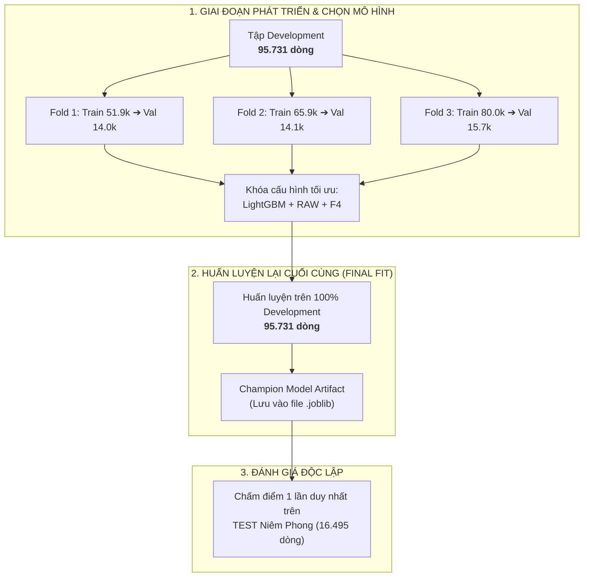
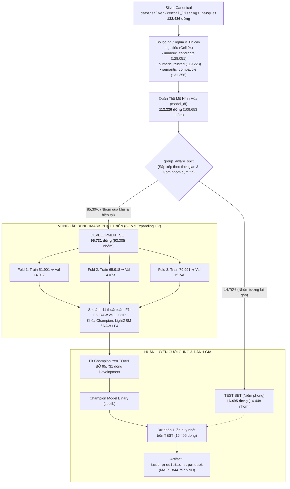

# Hiểu Đúng Về TRAIN, VALIDATION và TEST Trong Machine Learning & RoomBeacon

Tài liệu này được biên soạn nhằm giải thích bản chất cốt lõi của ba phân vùng dữ liệu quan trọng nhất trong Học máy (Machine Learning): **TRAIN**, **VALIDATION**, và **TEST**.

Tài liệu kết hợp giữa **nguyên lý khoa học dữ liệu tổng quát** và **cách thức cài đặt thực tế** trong hệ thống định giá bất động sản RoomBeacon (trọng tâm tại [04_roombeacon_modeling.ipynb](../04_roombeacon_modeling.ipynb)).

---

## Mở Đầu: Bài Toán Cốt Lõi — Tại Sao Không Thể Huấn Luyện Trên 100% Dữ Liệu?

Hãy tưởng tượng một tình huống thực tế trong học tập:
- Một học sinh được thầy cô phát cho bộ đề cương gồm 100 câu hỏi kèm đáp án chi tiết để ôn tập.
- Đến ngày thi cuối kỳ, thầy cô lại lấy **đúng nguyên văn 100 câu hỏi đó** làm bài thi.
- Học sinh đạt điểm tuyệt đối 10/10.

Điểm số 10/10 này chứng minh được điều gì? Nó chỉ chứng minh học sinh có **khả năng học vẹt và ghi nhớ (memorization)** các câu hỏi đã từng gặp. Nó **hoàn toàn không chứng minh** học sinh đã thực sự hiểu bản chất kiến thức để giải quyết một câu hỏi hoàn toàn mới ngoài đề cương.

Trong Machine Learning, vấn đề này xảy ra tương tự:
- **Sai số huấn luyện (Training Error):** Thước đo mức độ mô hình khớp với dữ liệu nó đã được nhìn thấy trong quá trình huấn luyện.
- **Khả năng khái quát hóa (Generalization Performance):** Khả năng mô hình dự đoán chính xác trên các bản ghi mới tinh trong tương lai mà nó **chưa từng gặp bao giờ**.
- **Hiện tượng học vẹt / Quá khớp (Overfitting):** Khi một mô hình học quá kỹ các chi tiết ngẫu nhiên, nhiễu (noise) và đặc điểm cá biệt của tập huấn luyện, khiến sai số trên tập huấn luyện rất thấp nhưng lại dự đoán sai lệch nghiêm trọng khi đem ra sử dụng thực tế.

Do đó, **chúng ta không bao giờ được phép huấn luyện mô hình trên 100% dữ liệu**. Chúng ta bắt buộc phải phân chia dữ liệu thành các phân vùng độc lập với vai trò tách biệt rõ ràng:
1. **TRAIN:** Để mô hình học các quy luật.
2. **VALIDATION:** Để người kỹ sư lựa chọn phương pháp xây dựng mô hình tối ưu.
3. **TEST:** Để chấm điểm độc lập lần cuối trước khi quyết định sử dụng.

---

## 01. TRAIN — Dữ Liệu Để Model Học

### 1. Khái Niệm Tổng Quát
Tập **TRAIN (Training Set)** là tập dữ liệu duy nhất mà thuật toán học máy được phép trực tiếp tiếp cận cả câu hỏi lẫn đáp án nhằm tìm ra các quy luật tiềm ẩn.

- **Đặc trưng ($X$):** Các biến đầu vào (Features) mô tả thuộc tính của đối tượng.
- **Mục tiêu ($y$):** Giá trị thực tế cần dự đoán (Target / Label).
- **Quá trình `.fit()`:** Là quá trình thuật toán tính toán và điều chỉnh các tham số nội tại (Internal Parameters) sao cho hàm dự đoán $\hat{y} = f(X)$ giảm thiểu tối đa sai số so với $y$.
- **Tại sao TRAIN được phép nhìn thấy nhãn ($y$)?** Vì mục đích của tập Train là học hỏi mối quan hệ giữa $X$ và $y$. Nếu không có nhãn, thuật toán học có giám sát (Supervised Learning) không thể biết dự đoán của mình đúng hay sai để tự tối ưu trọng số.

### 2. Áp Dụng Trong RoomBeacon
Trong bài toán định giá phòng cho thuê của RoomBeacon, phân vùng TRAIN cung cấp:
- **Đặc trưng đầu vào ($X$ thuộc tập F4):**
  1. `area_value_clean`: Diện tích sử dụng thực tế ($m^2$).
  2. `source_code`: Cổng thông tin đăng tin (Phongtro123, Chợ Tốt, Mogi, v.v.).
  3. `ward_current`: Phường/Xã hành chính chuẩn hóa.
  4. `district_text_extracted`: Quận/Huyện hành chính chuẩn hóa.
- **Biến mục tiêu ($y$):**
  - `price_model_value`: Giá thuê hàng tháng đã được kiểm toán độ tin cậy (VNĐ).
  - Biến đổi mục tiêu: `RAW` (sử dụng giá trị thực, không log1p).

```
X_train (diện tích, nguồn, phường, quận) + y_train (giá thuê VNĐ)
                 ↓
           model.fit()
                 ↓
    Mô hình LightGBM đã học được trọng số
```

---

## Bản Chất Thực Tế: RoomBeacon Không Có File `train.parquet`

> [!IMPORTANT]
> **RoomBeacon KHÔNG lưu trữ file `train.parquet` vật lý trên ổ đĩa.**

Trong nhiều dự án nhập môn, người ta thường lưu sẵn file `train.csv` hoặc `train.parquet`. Tuy nhiên, RoomBeacon tuân thủ kiến trúc phân tầng sạch:
1. **Nguồn chân lý duy nhất (Single Source of Truth):** Toàn bộ dữ liệu sạch duy nhất nằm ở `data/silver/rental_listings.parquet` (132.436 dòng).
2. **Không nhân bản dữ liệu (Zero Data Redundancy):** Việc lưu trữ các file train/val/test rời rạc trên đĩa dễ gây lệch pha phiên bản khi Silver được cập nhật lại.
3. **Phân vùng động trong bộ nhớ (Deterministic In-Memory Split):** Tập Train được tạo ra động trong RAM bằng code tại Cell 06 của [04_roombeacon_modeling.ipynb](../04_roombeacon_modeling.ipynb) với seed cố định (`SEED = 42`) và thuật toán sắp xếp thứ tự thời gian ổn định (`mergesort`).

Trong quá trình so sánh và lựa chọn mô hình, tập TRAIN không cố định mà **mở rộng dần theo thời gian (Expanding Temporal Folds)**:

```
Trục thời gian (Quá khứ ───────────────────────────────► Tương lai)

Fold 1: [--- TRAIN: 51.901 dòng ---][ VAL: 14.017 dòng ]
Fold 2: [------- TRAIN: 65.918 dòng -------][ VAL: 14.073 dòng ]
Fold 3: [----------- TRAIN: 79.991 dòng -----------][ VAL: 15.740 dòng ]
```

### Tại sao tập Train lại mở rộng dần?
Bất động sản là bài toán chuỗi thời gian (time-series). Mô hình triển khai vào tuần sau sẽ có nhiều dữ liệu lịch sử hơn mô hình triển khai tuần trước. Bằng cách mở rộng cửa sổ Train từ 51.9k $\rightarrow$ 65.9k $\rightarrow$ 80.0k dòng, hệ thống kiểm chứng xem thuật toán có duy trì độ ổn định và cải thiện khi được cung cấp thêm dữ liệu lịch sử hay không.

---

## Phân Biệt Sống Còn: Huấn Luyện Trong CV vs Huấn Luyện Mô Hình Cuối Cùng

Một trong những nhầm lẫn phổ biến nhất là: *"Mô hình vô địch (Champion) được huấn luyện trên tập nào?"*

### 1. Giai Đoạn Tuyển Chọn (Model Selection via CV)
Trong suốt quá trình so sánh các thuật toán, mỗi fold của Cross-Validation chỉ sử dụng cửa sổ Train của chính nó (51.9k ở Fold 1, 65.9k ở Fold 2, 79.9k ở Fold 3) để chạy `.fit()`, sau đó chấm điểm trên tập Validation tương ứng.

### 2. Giai Đoạn Đóng Băng & Huấn Luyện Lại Lần Cuối (Final Champion Fit)
Sau khi đã chốt xong:
- Tập đặc trưng tối ưu: **F4 — AREA + SOURCE + LOCATION**
- Biến đổi mục tiêu: **RAW**
- Thuật toán: **LightGBM Regressor**
- Bộ siêu tham số: `learning_rate=0.05`, `n_estimators=180`, `num_leaves=63`, `min_child_samples=30`, `objective='mae'`

Mô hình Champion cuối cùng (`roombeacon-price-lgbm-f4-raw-0b0c9d9fa450`) **KHÔNG** chỉ học trên 51.9k hay 79.9k dòng của một fold lẻ.
Mô hình cũng **KHÔNG** dừng lại ở 77.522 dòng của Train tĩnh ban đầu.

Nó được huấn luyện lại trên **TOÀN BỘ TẬP DEVELOPMENT GỒM 95.731 DÒNG**:



> [!NOTE]
> Trong suốt cả hai giai đoạn trên, **tập TEST (16.495 dòng) hoàn toàn không được tham gia vào bất kỳ lệnh `.fit()` nào.**

---

## 02. VALIDATION — Dữ Liệu Để Chọn Mô Hình

### 1. Khái Niệm Tổng Quát
Tập **VALIDATION (Validation Set)** là tập dữ liệu độc lập với tập Train, được sử dụng để đo lường chất lượng dự đoán của các phương án kỹ thuật khác nhau nhằm đưa ra các **quyết định thiết kế mô hình**.

Mô hình **không học trực tiếp trọng số** từ tập Validation (không gọi `fit(X_val, y_val)`). Nhưng người phát triển (hoặc thuật toán AutoML) sẽ quan sát sai số trên tập Validation để trả lời các câu hỏi:
- Nên chọn thuật toán nào (LightGBM, CatBoost, Random Forest, hay Linear Regression)?
- Nên dùng tập đặc trưng nào (F1, F2, F3, F4 hay F5)?
- Nên dùng hàm mục tiêu nào (`RAW` hay `LOG1P`)?
- Nên thiết lập siêu tham số thế nào (`learning_rate`, `max_depth`, `num_leaves`)?
- Mô hình phức tạp hơn có thực sự đáng để đánh đổi không (Quy tắc đơn giản / Parsimony)?

### 2. Ví Dụ Cụ Thể Trong RoomBeacon
Tại Notebook 04, tập Validation được sử dụng cho hàng loạt quyết định thực nghiệm:
1. **Quyết định F4 vs F5 (Cell 10):**
   - LightGBM trên F4 đạt MAE 941.954 VNĐ; trên F5 đạt MAE 942.554 VNĐ (F5 bị kém đi 600 VNĐ).
   - Vì F5 không mang lại cải thiện đồng nhất, hệ thống tự động khóa tập đặc trưng gọn nhẹ hơn là **F4**.
2. **Quyết định RAW vs LOG1P (Cell 12):**
   - So sánh toàn bộ 11 mô hình dưới cả hai dạng biến đổi mục tiêu để chọn cấu hình tối ưu.
3. **Quyết định thuật toán & Tinh chỉnh siêu tham số (Cell 14):**
   - LightGBM đạt kết quả cân bằng nhất giữa MAE (trung bình 883.025 VNĐ trên các fold) và độ phức tạp runtime, vượt qua CatBoost và HistGradientBoosting.

---

## Tại Sao VALIDATION Không Thể Là Bài Thi Cuối Cùng?

Nếu mô hình không được huấn luyện trên tập Validation, tại sao chúng ta không lấy luôn điểm số Validation làm kết quả báo cáo cuối cùng?

### Nguyên Nhân: "Rò Rỉ Ở Tầng Ra Quyết Định" (Information Leakage via Tuning)
Hãy xem xét quy trình làm việc thông thường của một kỹ sư:
1. Thử Mô hình A $\rightarrow$ Đánh giá trên Validation $\rightarrow$ MAE = 950.000 VNĐ.
2. Thử Mô hình B $\rightarrow$ Đánh giá trên Validation $\rightarrow$ MAE = 910.000 VNĐ.
3. Thử Mô hình C $\rightarrow$ Đánh giá trên Validation $\rightarrow$ MAE = 880.000 VNĐ.
4. Kỹ sư quyết định: *"Tôi chọn Mô hình C!"*

Mặc dù Mô hình C không trực tiếp nhìn thấy dữ liệu Validation trong lệnh `.fit()`, nhưng **người kỹ sư đã nhìn thấy kết quả Validation hàng chục lần để đưa ra quyết định giữ lại Mô hình C và vứt bỏ Mô hình A, B**.

Nói cách khác, tập Validation đã bị **"mòn" (contaminated)** do được dùng làm căn cứ tối ưu hóa. Điểm số của Mô hình C trên Validation chắc chắn sẽ có xu hướng lạc quan hơn so với thực tế bên ngoài. 

Đó là lý do chúng ta bắt buộc phải có một tập thứ ba hoàn toàn biệt lập: **TEST SET**.

---

## Tính Chất Động Của VALIDATION Trong RoomBeacon

RoomBeacon không dựa dẫm vào một file tĩnh `validation.parquet` duy nhất. Nếu chỉ dùng 1 tập validation cố định, kết quả có thể bị thiên lệch do thời tiết, lễ tết hoặc biến động thị trường ngắn hạn trong khoảng thời gian đó.

Thay vào đó, hệ thống sử dụng **3 cửa sổ validation trượt theo thời gian**:
- **Fold 1 Validation (14.017 dòng):** Từ ngày `2026-09-26 16:37:36` đến `2026-09-27 15:53:07`.
- **Fold 2 Validation (14.073 dòng):** Từ ngày `2026-09-28 07:44:27` đến `2026-09-28 16:36:25`.
- **Fold 3 Validation (15.740 dòng):** Từ ngày `2026-09-28 16:36:28` đến `2026-09-29 11:39:27`.

Mô hình phải chứng minh năng lực ổn định và độ lệch chuẩn thấp xuyên suốt cả 3 cửa sổ thời gian này mới được đưa vào danh sách ứng viên khóa.

---

## 03. TEST — Bài Thi Cuối Cùng

### 1. Khái Niệm Tổng Quát
Tập **TEST (Test Set)** là tập dữ liệu dự phòng được niêm phong nghiêm ngặt (Sealed Holdout). Nó đóng vai trò như bài thi tốt nghiệp chuẩn hóa:
- **Tuyệt đối không được fit:** Không bao giờ gọi `fit(X_test, y_test)`.
- **Tuyệt đối không dùng để chọn đặc trưng hay siêu tham số:** Không được nhìn kết quả Test để chỉnh lại mô hình.
- **Chỉ mở một lần duy nhất:** Sau khi toàn bộ cấu hình mô hình đã được đóng băng hoàn toàn.

### 2. Quy Trình Chuẩn (The Correct Sequence)
```
[ TRAIN + VALIDATION ] ──► Thử nghiệm, so sánh, tinh chỉnh
                                      ↓
                              KHÓA CỨNG (LOCK) CHAMPION
                                      ↓
                                  MỞ TẬP TEST
                                      ↓
                           ĐÁNH GIÁ 1 LẦN DUY NHẤT (UNBIASED)
```

---

## Hợp Đồng Phân Vùng TEST Trong RoomBeacon

Tại RoomBeacon, tập TEST tuân thủ các quy tắc bất biến:
- **Quy mô chính xác:** **16.495 dòng** (tương ứng 16.448 nhóm, chiếm 14,70% quần thể mô hình hóa).
- **Tính chất thời gian:** Là phân khúc dữ liệu mới nhất theo trục thời gian quan sát.
- **Rào chắn bảo vệ trong mã nguồn:**
  ```python
  assert LOCKED_MODEL and not TEST_ACCESSED_FOR_SELECTION
  TEST_ACCESSED_FOR_SELECTION = True
  ```
  Nếu có bất kỳ ai cố tình truy cập tập TEST trước khi khóa mô hình, chương trình sẽ báo lỗi (`AssertionError`) ngay lập tức.

---

## Bản Chất Của File `test_predictions.parquet`

Trong thư mục `data/modeling/roombeacon_price_benchmark_v3/`, bạn sẽ thấy một file tên là `test_predictions.parquet`.

> [!WARNING]
> **`test_predictions.parquet` KHÔNG PHẢI là tập dữ liệu test thô ban đầu.**

Đây là file lưu trữ **KẾT QUẢ DỰ ĐOÁN** của Champion model và các mô hình cơ sở (Baselines) trên 16.495 dòng của tập TEST niêm phong.

### Cấu Trúc Schema Thực Tế Của File:
| Tên cột | Ý nghĩa |
| :--- | :--- |
| `rental_post_id` | Khóa định danh tin đăng thuê |
| `group_key` | Khóa nhận diện cụm tin đăng trùng lặp |
| `actual_price` | Giá thực tế của tin đăng ($y_{test}$) |
| `source_code` | Cổng thông tin (Chợ Tốt, Phongtro123...) |
| `ward_current` | Tên phường/xã chuẩn hóa |
| `district_text_extracted` | Tên quận/huyện chuẩn hóa |
| `province_text_extracted` | Tên tỉnh/thành phố chuẩn hóa |
| `area_value_clean` | Diện tích phòng ($m^2$) |
| `ward_mapping_status` | Trạng thái ánh xạ hành chính của phường |
| `parse_status` | Trạng thái phân tích địa chỉ |
| `title_clean` | Tiêu đề tin đăng đã làm sạch |
| `latest_observed_at` | Mốc thời gian quan sát cuối cùng |
| `Global Median` | Giá trị dự đoán của mô hình cơ sở Trung vị toàn cục |
| `Hierarchical Location Median` | Giá trị dự đoán của mô hình cơ sở Trung vị vị trí phân cấp |
| `Hierarchical Segment Median` | Giá trị dự đoán của mô hình cơ sở Trung vị phân khúc |
| `LightGBM Regressor` | **Giá trị dự đoán của Champion Model** |

File này được bảo tồn làm bằng chứng kiểm toán (Audit Evidence) để chứng minh hiệu năng dự đoán trên tập Test mà không cần chạy lại toàn bộ mã huấn luyện.

---

## Tại Sao Tuyệt Đối Không Được Tái Sử Dụng TEST Để Chọn Model?

Hãy xem xét quy trình sai lầm sau đây:
```
[Sai lầm phổ biến]
1. Train mô hình ➔ Đo MAE trên TEST = 900.000 VNĐ
2. Đổi learning_rate từ 0.05 sang 0.03 ➔ Đo TEST lại = 880.000 VNĐ (thấy tốt hơn)
3. Thêm đặc trưng mới ➔ Đo TEST lại = 860.000 VNĐ
4. Lặp lại 30 lần...
```

Hậu quả: **Tập TEST đã bị biến thành một tập VALIDATION thứ hai.**
Lúc này, điểm số trên tập Test không còn đại diện cho khả năng khái quát hóa nữa. Khi đưa mô hình ra môi trường thực tế, sai số chắc chắn sẽ tăng vọt vì mô hình đã bị "overfitting ở cấp độ quyết định" (Overfitting on Test Set).

---

## Thiết Kế Phân Vùng Nhận Thức Nhóm & Trình Tự Thời Gian (Group-Aware Temporal Design)

Tại sao RoomBeacon không thể dùng hàm chia ngẫu nhiên thông thường như `train_test_split(..., random_state=42)` của thư viện scikit-learn?

Đối với dữ liệu tin đăng bất động sản cào từ internet (Crawler Data), việc chia ngẫu nhiên thông thường sẽ dẫn đến **rò rỉ dữ liệu thảm khốc (Catastrophic Data Leakage)** vì hai lý do:

### 1. Tin Đăng Trùng Lặp (Duplicate Reposts)
Một chủ nhà hoặc môi giới thường đăng cùng một căn phòng lên nhiều trang khác nhau (Chợ Tốt, Phongtro123, Batdongsan), hoặc đăng lại nhiều lần trong tuần.
- Nếu chia ngẫu nhiên: Tin đăng ngày 20/09 lọt vào **Train**, bản sao của chính nó vào ngày 21/09 lọt vào **Test**.
- Mô hình chỉ việc nhớ giá của căn phòng đó ở Train và đọc lại ở Test. Kết quả kiểm tra sẽ hoàn hảo giả tạo, nhưng thực tế mô hình không học được quy luật định giá nào.
- **Giải pháp của RoomBeacon:** Sử dụng thuật toán Union-Find gom cụm các tin trùng thành `group_key`. Cơ chế **Group Isolation** bắt buộc 100% tin trong cùng một cụm phải ở cùng một phân vùng (Group Overlap giữa Train, Val, Test luôn luôn bằng 0).

### 2. Chiều Thời Gian Thực Tế (Chronological Reality)
Trong sản xuất, mô hình được huấn luyện dựa trên dữ liệu quá khứ và phải định giá cho các tin đăng trong tương lai.
- Nếu chia ngẫu nhiên: Mô hình sẽ dùng tin đăng của ngày mai để dự đoán giá của ngày hôm qua.
- **Giải pháp của RoomBeacon:** Sắp xếp toàn bộ dữ liệu theo mốc thời gian `latest_observed_at`. Quá khứ vào Train, hiện tại vào Validation, tương lai vào Test. Các bản ghi có mốc thời gian trùng nhau ở điểm ranh giới được đẩy sang phân vùng sau (`_move_cut_past_ties`) để tránh xé lẻ thời điểm.

---

## Sơ Đồ Tổng Thể Luồng Dữ Liệu Của RoomBeacon



---

## Bảng So Sánh Khái Niệm

### 1. Bảng Khái Niệm Tổng Quát (Machine Learning Fundamentals)
| Tập dữ liệu | Model học trực tiếp? | Dùng để ra quyết định chọn model? | Mục đích cốt lõi |
| :--- | :---: | :---: | :--- |
| **TRAIN** | **Có** (`.fit()`) | Gián tiếp | Học các quy luật, trọng số và tương quan giữa $X$ và $y$ |
| **VALIDATION** | **Không** | **Có** | Đo lường khách quan các phương án để chọn thuật toán, đặc trưng, siêu tham số |
| **TEST** | **Không** | **Không** | Chấm điểm độc lập lần cuối cho mô hình đã khóa, không được can thiệp vào thiết kế |

### 2. Bảng Cài Đặt Thực Tế Trong RoomBeacon
| Khái niệm | Cách cài đặt thực tế trong RoomBeacon | Số lượng bản ghi hiện tại |
| :--- | :--- | :---: |
| **Train (CV)** | Các cửa sổ thời gian mở rộng tăng dần theo từng fold | Fold 1: 51.901 dòng<br/>Fold 2: 65.918 dòng<br/>Fold 3: 79.991 dòng |
| **Validation (CV)** | Các cửa sổ thời gian đánh giá tiếp nối ngay sau Train | Fold 1: 14.017 dòng<br/>Fold 2: 14.073 dòng<br/>Fold 3: 15.740 dòng |
| **Development** | Không gian sandbox hợp nhất toàn bộ Train tĩnh + Validation tĩnh để phát triển mô hình | **95.731 dòng** (93.205 nhóm) |
| **Final Fit** | Huấn luyện lại Champion đã khóa trên toàn bộ không gian Development | **95.731 dòng** |
| **Test** | Tập dữ liệu tương lai niêm phong tuyệt đối, dự đoán 1 lần duy nhất | **16.495 dòng** (16.448 nhóm) |

---

## Khái Niệm Về Tập DEVELOPMENT Trong RoomBeacon

Tại sao RoomBeacon lại đưa ra khái niệm **DEVELOPMENT SET**?

- **Development Set (95.731 dòng):** Là hợp nhất của tập Train tĩnh ban đầu (77.522 dòng) và Validation tĩnh ban đầu (18.209 dòng).
- **Ý nghĩa:** Development đóng vai trò là "sân chơi" (Playground) hợp lệ của các kỹ sư khoa học dữ liệu. Mọi thử nghiệm, chạy cross-validation, cắt bỏ đặc trưng (ablation), tinh chỉnh tham số đều chỉ được phép diễn ra bên trong 95.731 dòng này.
- **Tập TEST (16.495 dòng):** Nằm hoàn toàn bên ngoài sân chơi Development. Nó là "phòng thi được khóa kín", bảo vệ tính trung thực của kết quả nghiệm thu.

### Lưu ý về các nhãn tĩnh ban đầu (77.522 vs 18.209):
Khi xem mã nguồn của `group_aware_split`, bạn sẽ thấy các nhãn ban đầu được gắn là:
- `TRAIN`: 77.522 dòng
- `VALIDATION`: 18.209 dòng
- `TEST`: 16.495 dòng

Điều này **KHÔNG CÓ NGHĨA** là RoomBeacon chỉ đơn giản fit một lần trên 77.522 dòng rồi validate trên 18.209 dòng. Thay vào đó, mã nguồn gộp 77.522 dòng và 18.209 dòng thành `development_df` (95.731 dòng), sau đó mới cắt thành 3 expanding folds linh hoạt để benchmark.

---

## Rò Rỉ Dữ Liệu Trong Tiền Xử Lý (Preprocessing Leakage)

Một lỗi rất nghiêm trọng trong thực tế là thực hiện tiền xử lý dữ liệu (Preprocessing) trên toàn bộ dataset trước khi chia tập.

Ví dụ:
- Tính giá trị trung vị (median) của cột diện tích trên 100% dữ liệu rồi điền khuyết.
- Chuẩn hóa thang đo (StandardScaler / MinMax) trên 100% dữ liệu.
- Xây dựng từ điển danh mục (Categorical Vocabularies) trên 100% dữ liệu.

Nếu làm như vậy, thông tin phân phối của tập Test đã vô tình rò rỉ vào tập Train thông qua giá trị trung vị hoặc khoảng biến thiên!

### Cơ chế bảo vệ của RoomBeacon:
Trong RoomBeacon:
1. Giá trị trung vị điền khuyết (`SimpleImputer(strategy='median')`) và thống kê phân vị chỉ được fit trên tập Train của fold đó (hoặc tập Development).
2. Hàm `prepare_lightgbm_categories`: Chỉ ghi nhận danh mục (phường, quận, nguồn) có mặt ở tập Train.
3. Khi gặp phường hoặc quận mới xuất hiện ở tập Validation hoặc Test, hệ thống tự động quy về giá trị **`__UNKNOWN__`** thay vì báo lỗi hoặc học trước từ điển.

---

## Bước Tiếp Theo: Từ TEST Đến SHADOW và PRODUCTION

Sau khi hoàn tất đánh giá trên tập TEST, vòng đời của mô hình học máy vẫn chưa dừng lại:

$$\text{TRAIN} \longrightarrow \text{VALIDATION} \longrightarrow \text{TEST} \longrightarrow \mathbf{SHADOW} \longrightarrow \text{PRODUCTION}$$

### SHADOW Khác Gì So Với Ba Tập Trên?
- **TRAIN, VALIDATION, TEST** đều là các lát cắt được trích xuất từ cùng một snapshot dữ liệu lịch sử trong quá khứ (ở đây là snapshot tháng 09/2026).
- **SHADOW (Chế độ chạy ngầm - Shadow Validation):** Là bước đưa mô hình Champion vào hệ thống thực tế để nhận dữ liệu tin đăng mới phát sinh mỗi ngày từ crawler, thực hiện dự đoán hoàn toàn không có nhãn target, sau đó theo dõi độ trôi dạt dữ liệu (Data Drift), độ trôi dạt dự đoán (Prediction Drift), và đo lường độ trễ (Latency).
- Chi tiết về quy trình chạy Shadow được ghi lại tại [06_roombeacon_shadow_validation.ipynb](../06_roombeacon_shadow_validation.ipynb) (xem tài liệu [06_shadow_validation_explained.md](./notebook_explanations/06_shadow_validation_explained.md)).

---

## Hộp Ghi Nhớ Cốt Lõi (Core Memory Box)

Để nắm chắc nguyên lý phân vùng trong bất kỳ bài toán Machine Learning nào, bạn chỉ cần ghi nhớ 4 dòng cốt tử sau:

```
┌────────────────────────────────────────────────────────────────────────┐
│  TRAIN       ──►  Model học các quy luật                              │
│  VALIDATION  ──►  Người chọn cách xây dựng model                      │
│  TEST        ──►  Chấm điểm khách quan model đã khóa                  │
│  SHADOW      ──►  Kiểm chứng độ ổn định trên dữ liệu tương lai thực tế│
└────────────────────────────────────────────────────────────────────────┘
```
